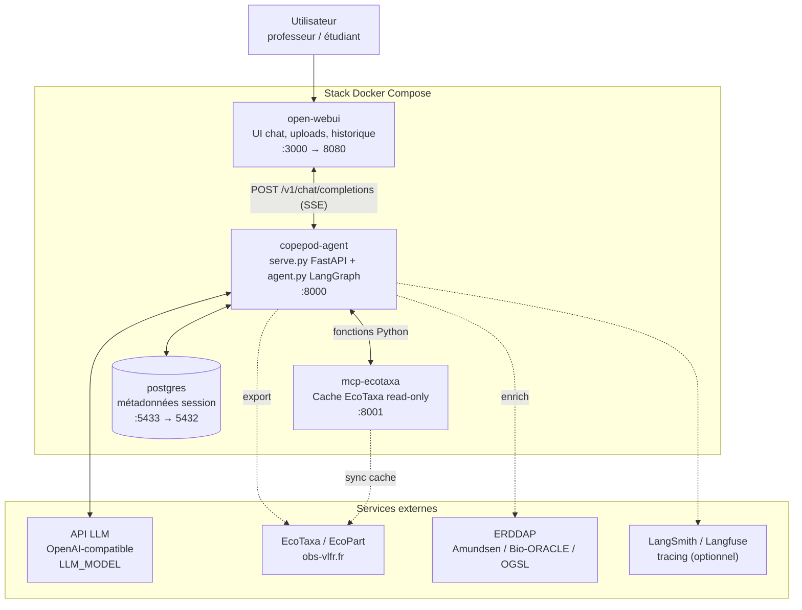
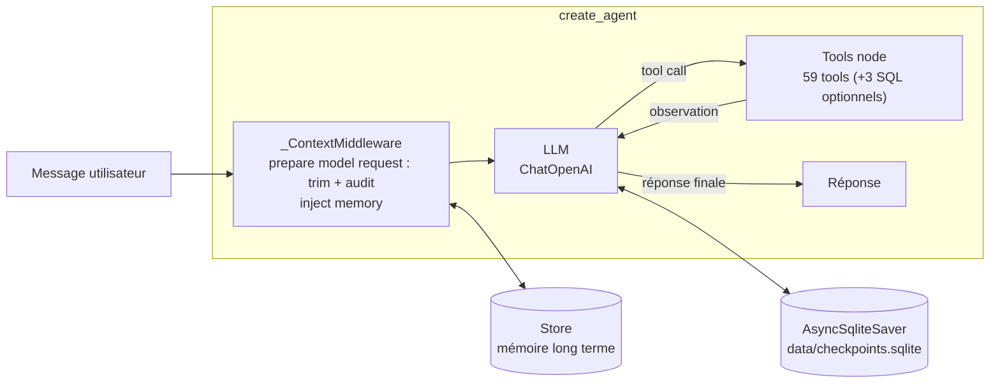

# ARCHITECTURE.md — Architecture logicielle · IDEA

> Comment `agent.py`, `serve.py`, les tools, le RAG, le MCP EcoTaxa et Open WebUI
> sont câblés. Pour le périmètre fonctionnel voir [`SPEC.md`](SPEC.md), pour les
> flux détaillés voir [`SEQUENCES.md`](SEQUENCES.md), pour le déploiement voir
> [`PARTAGE.md`](PARTAGE.md).

---

## 1. Vue d'ensemble

Le système est composé de **quatre services** orchestrés par Docker Compose,
plus des dépendances externes (LLM, sources ERDDAP/EcoTaxa).



**Points structurants :**
- Un **seul agent ReAct**. Pas de « mode ». Le modèle suit le system prompt; les autorisations critiques, dont la source, sont appliquées par le control plane Python.
- Le code est monté en volume (`.:/app`) avec `uvicorn --reload` en dev : hot-reload, pas de rebuild.
- L'agent IDEA n'appelle **pas** le MCP EcoTaxa via HTTP : il réutilise les mêmes fonctions Python (`core/ecotaxa_browser/`) via les wrappers LangChain de `tools/copepod_sources.py`. Le service `mcp-ecotaxa` HTTP sert surtout aux agents externes et au cache partagé.

---

## 2. Couche transport — `serve.py` (FastAPI, port 8000)

Expose une API OpenAI-compatible consommée par Open WebUI.

| Route | Méthode | Rôle |
|---|---|---|
| `/` | GET | Health check |
| `/version` | GET | Version de l'image |
| `/v1/models` | GET | Liste des modèles (compat OpenAI) |
| `/v1/embeddings` | POST | Embeddings (compat OpenAI) |
| `/v1/chat/completions` | POST | **Point d'entrée principal**, streaming SSE |
| `/graphs/{filename}` | GET | Sert les PNG générés par `run_graph` |
| `/downloads/{filename}` | GET | Sert les exports/livrables téléchargeables |
| `/feedback` | POST | Réception du feedback Open WebUI |
| `/feedback/tap/ping` | POST | Polling temps réel du feedback |
| `/debug/context-audit` | GET | Audit du contexte injecté |

Responsabilités : streaming SSE des tokens et de la progression des tools,
hébergement des images et des downloads, polling du feedback Open WebUI,
mapping requête OpenAI ↔ invocation LangGraph.

### Cartographie autonome et stockage des PNG

Les quatre fonds Natural Earth 110m utilisés par les gabarits Cartopy (terre,
océan, côtes et frontières nationales) sont embarqués sous `assets/cartopy/`,
hors du volume runtime `/app/data`.
`core/cartography.py` valide ce bundle et le déclare comme
`pre_existing_data_dir` avant chaque exécution de `run_graph` : une première
carte ne déclenche donc aucun téléchargement Cartopy.

`core/runtime_paths.py` donne un répertoire commun au producteur graphique et à
la route `/graphs/`. Par défaut local, il s'agit de `data/graphs`; les fichiers
Compose définissent `GRAPHS_DIR=/app/data/graphs`, à l'intérieur du volume
persistant `copepod_data`.

---

## 3. Couche agent — `agent.py` (LangGraph ReAct)



### Construction (`agent.py`)
- **System prompt** : `COPEPOD_SYSTEM_PROMPT` local, ou pull depuis LangSmith Hub (`copepod-system-prompt`) en prod avec fallback local.
- **LLM** : `ChatOpenAI(model=LLM_MODEL)`, `max_tokens=LLM_MAX_OUTPUT_TOKENS` (défaut 16000), `max_retries=2`.
- **Assemblage des tools** :
  ```python
  catalog = build_tool_catalog(thread_id)
  create_agent(llm, list(catalog.tools), ...)
  ```
  `tools/tool_catalog.py` est le seam unique de composition et de présentation :
  il appelle les factories par famille, ajoute les 3 tools SQL seulement si
  `DATABASE_URL` est résolvable, valide les noms uniques et fournit les libellés
  utilisateur français/anglais. Les noms internes et les schémas LangChain ne
  changent pas.
- **Présentation dynamique au modèle** : le catalogue complet reste enregistré
  auprès de LangGraph, puis `tools/tool_exposure.py` produit une allowlist
  déterministe de **15 tools maximum par appel modèle** à partir du
  `TurnContext`, de la `SourceDecision`, des intentions non géographiques et
  des tools/skills réussis dans le tour. Le noyau permanent contient
  `load_file`, `load_skill` et le RAG. Les deux capacités géographiques sont
  toujours visibles : le modèle principal choisit sémantiquement de les utiliser,
  sans regex ni classifieur additionnel. EcoTaxa conserve toujours son groupe
  zone/période et au plus un autre groupe d'intention; EcoPart, Amundsen,
  Bio-ORACLE et OGSL n'exposent que leur route
  d'enrichissement canonique lorsqu'un fichier actif doit explicitement être
  enrichi avec la source nommée. Les routes legacy masquées restent dans le
  catalogue pour compatibilité, mais la garde pré-tool applique la même
  décision et les bloque fail-closed.
- **`_ContextMiddleware`** (agent construit via `create_agent`, LangChain 1.x) :
  - `wrap_model_call` / `awrap_model_call` préparent la requête réellement envoyée au LLM : filtrage de source, allowlist dynamique des tools, troncature du contenu des résultats de tools au-delà de `MAX_TOOL_RESULT_CHARS` (défaut 8000), puis conservation du suffixe récent sous `MAX_CONTEXT_TOKENS` (défaut 40000), à partir d'un message humain pour préserver les paires `tool_call` / `ToolMessage`. Le budget des schémas est recalculé après filtrage.
  - Le trim utilise `request.override(messages=...)` : il borne le contexte du modèle sans supprimer l'historique complet conservé dans le checkpoint LangGraph.
  - Les mêmes wrappers injectent le bloc mémoire long terme (`store.search` / `asearch` sur `(user_id, "memories")`) dans le system prompt. Les deux variantes existent car `serve.py` invoque en async avec un store async.
  - Ils reconstruisent aussi un `TurnContext` typé (`tools/turn_context.py`) en début de tour et injectent sa projection — la **carte d'état de session** (`build_dataset_state_capsule`) : dataset actif, roster `LOADED FILES` (tous les fichiers chargés par nom), `DERIVED ZONE SUBSETS` (variable↔zone), et `ACTIVE SOURCE SCOPE` (sources autorisées). L'agent lit son état au lieu de le ré-inférer de l'historique.
  - L'audit `/debug/context-audit` décrit la requête préparée, avec les tokens du system prompt, le total modèle, les champs `TurnContext` (variable active, sources autorisées, nb de dérivés), les groupes/noms de tools exposés, les schémas économisés, l'alerte à 12 et un indicateur explicite lorsque le dernier tour complet dépasse à lui seul la limite.
  - `wrap_tool_call` / `awrap_tool_call` appliquent aussi la garde graphique. Elle n'appelle le classifieur structuré qu'à la première tentative graphique du tour, partage la décision par un verrou single-flight sync/async, puis autorise uniquement une intention `visual`. La progression planner → writer → rendu est reconstruite depuis les ToolMessages `success` postérieurs au dernier message humain; les anciennes activations et les lots parallèles ne donnent aucune autorisation.
- **Checkpointer** : `AsyncSqliteSaver` sur `CHECKPOINTS_DB` (`data/checkpoints.sqlite`), clé par `thread_id`. Fallback `MemorySaver` selon le contexte.
- **Store** : mémoire long terme (`InMemoryStore` ou store persistant).

### Boucle ReAct
Raisonnement → appel de tool → observation → raisonnement, jusqu'à la réponse
finale. Le modèle choisit le tool à l'intérieur de l'allowlist calculée pour
l'appel courant. `tools/source_scope.py` calcule une `SourceDecision`
persistante et filtre d'abord les familles externes; `tools/tool_exposure.py`
réduit ensuite le choix selon le contexte et les intentions non géographiques,
tout en conservant les capacités géographiques. Les deux décisions sont rejouées
avant exécution afin de bloquer fail-closed un appel hors source ou masqué. Le
bloc prompt de sélection des sources reste généré depuis la même politique.

---

## 4. Couche tools (`tools/`)

Chaque famille est produite par une factory `make_*_tools(thread_id)` qui capture
le `thread_id` pour scoper la session. Un tool est une fonction décorée `@tool`
dont la **docstring** est lue par le LLM pour décider quand l'appeler.

| Module | Famille | Détail SPEC |
|---|---|---|
| `tool_catalog.py` | Composition, validation, groupes d'exposition et présentation bilingue des 59/62 tools | §3, §4 |
| `tool_exposure.py` | Allowlist déterministe par appel modèle (maximum 15) | §3 |
| `data_tools.py` | Fichier & analyse & graphe | §4.1 |
| `copepod_sources.py` | EcoTaxa (read-only + export) | §4.2 |
| `ecopart_sources.py` | EcoPart + join/enrichissement | §4.3 |
| `amundsen_sources.py` | Amundsen CTD | §4.4 |
| `bio_oracle_sources.py` | Bio-ORACLE | §4.5 |
| `ogsl_sources.py` | OGSL ISMER CTD | §4.6 |
| `sql_workspace.py` | Workspace SQL read-only | §4.7 |
| `geo_tools.py` | Zones IHO/MEOW | §4.8 |
| `rag_tool.py` | RAG NeoLab | §4.9 |
| `taxonomy_tool.py` | Taxonomie WoRMS | §4.9 |
| `skill_tool.py` | Chargement de skills | §4.10 |
| `deliverable_tool.py` | Export PDF | §4.10 |

Modules de support (non exposés au LLM) : `file_loader.py`, `dataset_registry.py`,
`run_store.py`, `session_store.py` / `session_store_pg.py`, `public_url.py`,
`openwebui_uploads.py`, `feedback.py`, `ecotaxa_client.py`.

---

## 5. État de session

L'état d'une conversation est réparti sur trois supports :

| Support | Contenu | Persistance |
|---|---|---|
| LangGraph checkpoints (`AsyncSqliteSaver`) | Historique des messages par `thread_id` | `data/checkpoints.sqlite` |
| Session store (`session_store*.py`) | DataFrames nommées, métadonnées de session | PostgreSQL si `SESSION_STORE_DATABASE_URL`, sinon fichiers locaux dans `data/` |
| Store LangGraph | Mémoire long terme (préférences, contexte) | InMemory ou persistant |

Une conversation portant la même identité utilisateur et le même `chat_id`
reprend ses DataFrames et alias persistés après un redémarrage du serveur.
Aucune requête ne réinitialise cet état implicitement. La remise à zéro interne
passe par `clear_conversation(thread_id)`, qui supprime la clé active et toute
sa famille `thread_id:*`; `clear(key)` reste une suppression ciblée.

Les DataFrames de session sont référencées par variables explicites
(`df_ecotaxa`, `df_ecopart`, `df_ecotaxa_ecopart_105`, `df_ctd`, `df_bio_oracle`,
`df_sql`, `df_in_<zone>_<source>`, …). `df` seul = dernière table active,
instable en multi-source.

---

## 6. Cœur métier (`core/`)

| Module | Rôle |
|---|---|
| `copepod_rag/` | ChromaDB + 11 docs Markdown, `build_index.py` |
| `ecotaxa_browser/` | Logique pure Python d'exploration EcoTaxa (partagée agent + MCP) |
| `mcp/` | Serveur MCP EcoTaxa (HTTP streamable), `README.md` technique |
| `amundsen_ctd_client.py`, `bio_oracle_client.py`, `ecopart_client.py`, `ogsl_client.py` | Clients ERDDAP / API sources |
| `erddap_batching.py`, `erddap_cache.py`, `canonical_grid.py` | Robustesse et cache des requêtes ERDDAP |
| `geo/`, `environment_resolver/`, `enrich_scoping.py` | Résolution zones + scoping des enrichissements |
| `taxonomy_lookup/` | Résolution taxon (WoRMS/Wikipedia) |
| `instruction_renderer/` | Composition des system prompts |

---

## 7. MCP EcoTaxa (`mcp-ecotaxa`, port 8001)

Service séparé qui maintient un **cache SQLite read-only** d'EcoTaxa (samples,
projets, schémas, zones) pour une découverte géographique/temporelle rapide.

- Transport : MCP streamable HTTP sur `http://…:8001/mcp`, protégé par `MCP_AUTH_TOKEN` (Bearer).
- Endpoints admin : `/health`, `POST /admin/resync`.
- Sync nocturne optionnel (`ECOTAXA_NIGHTLY_SYNC`, `ECOTAXA_SYNC_HOUR`).
- États : `CACHE_EMPTY`, `SYNC_IN_PROGRESS`, réponses `partial=True`.
- L'agent IDEA consomme la **même logique en Python** (pas via HTTP). Le service HTTP est destiné aux agents MCP externes — voir [`PARTAGE.md`](PARTAGE.md).

Détails : `docs/mcp/MCP_ECOTAXA_SHARE_GUIDE.md`, `docs/mcp/MCP_CAPABILITIES.md`, `core/mcp/README.md`.

---

## 8. Configuration (variables d'environnement)

| Variable | Rôle | Défaut |
|---|---|---|
| `OPENAI_API_KEY` | Provider LLM | requis |
| `LLM_MODEL` | Modèle | `gpt-5.4-mini` |
| `LLM_MAX_OUTPUT_TOKENS` | Tokens de sortie max | 16000 |
| `MAX_CONTEXT_TOKENS` | Seuil de trim de l'historique | 40000 |
| `MAX_TOOL_RESULT_CHARS` | Seuil de troncature des résultats de tools | 8000 |
| `CHECKPOINTS_DB` | SQLite des checkpoints | `data/checkpoints.sqlite` |
| `DATABASE_URL` | Workspace SQL read-only | optionnel |
| `SESSION_STORE_DATABASE_URL` | PostgreSQL métadonnées session | fallback fichiers |
| `POSTGRES_PASSWORD` | Mot de passe PostgreSQL | `copepod_dev` (dev) |
| `MCP_AUTH_TOKEN` | Bearer du MCP EcoTaxa | requis pour MCP |
| `ECOTAXA_USERNAME` / `ECOTAXA_PASSWORD` | Credentials EcoTaxa/EcoPart | requis pour sources |
| `OPENWEBUI_URL` | Backend Open WebUI (feedback polling) | `http://open-webui:8080` |
| `LANGCHAIN_TRACING_V2` / `LANGSMITH_API_KEY` | Tracing + pull Hub des skills (system prompt lu localement) | optionnel |
| `LANGFUSE_*` | Langfuse self-hosted | optionnel |

`.env` porte les credentials — jamais commité, jamais affiché.

---

## 9. Points d'entrée & scripts

| Fichier | Rôle |
|---|---|
| `serve.py` | Serveur FastAPI (prod + dev) |
| `agent.py` | Agent + REPL CLI (`python agent.py`, ou `python agent.py fichier.tsv "question"`) |
| `studio.py` | Entrée LangGraph Studio |
| `langgraph.json` | Config LangGraph |
| `start.sh` | Orchestration Docker (Postgres + MCP + agent + Open WebUI) |
| `scripts/dev/push_prompt.py` | Sync system prompt → LangSmith Hub |
| `scripts/dev/push_skills.py` | Sync skills → LangSmith Hub |

---

## 10. Décisions d'architecture (ADR condensés)

| # | Décision | Raison |
|---|---|---|
| A1 | Un seul agent ReAct, pas de modes | Simplicité de raisonnement ; le comportement vient du prompt, pas d'états à gérer |
| A2 | Choix du tool expliqué dans le prompt; autorisation de source en Python | Le modèle garde la souplesse de navigation, mais une source non sélectionnée reste inexécutable |
| A3 | RAG (savoir) ≠ Skills (geste) | Séparer recherche vectorielle et chargement en bloc de procédures |
| A4 | MCP EcoTaxa comme cache read-only séparé | Découverte géo/temps rapide sans re-frapper EcoTaxa ; réutilisable par agents externes |
| A5 | Agent IDEA appelle le cœur Python, pas le MCP HTTP | Moins de latence, pas de dépendance réseau interne |
| A6 | Source en ligne nommée à la première utilisation, puis affinité persistante; confirmation séparée pour le coûteux | Éviter les bascules involontaires sans imposer de répéter le nom à chaque suivi |
| A7 | Session state réparti (checkpoints + session store + store) | Séparer historique de conversation, DataFrames, et mémoire long terme |
| A8 | Images multi-arch sur GHCR + Watchtower | Déploiement provider-agnostic, mise à jour continue |
