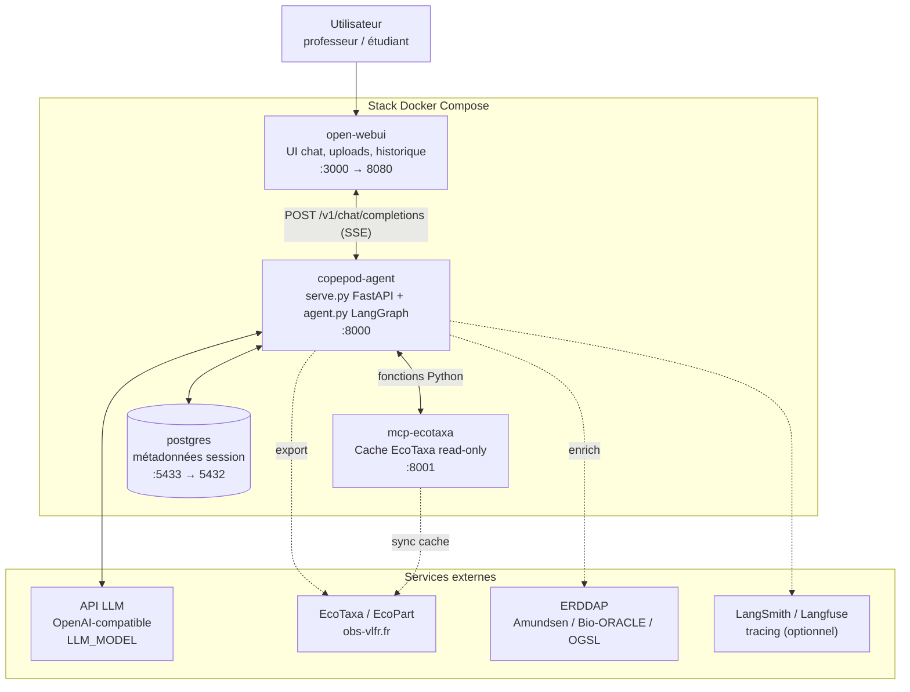
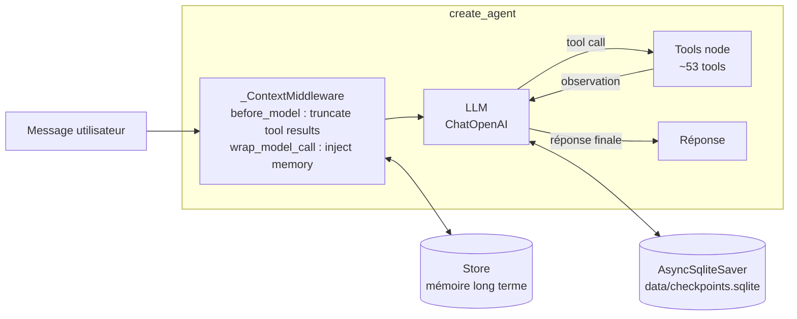

# ARCHITECTURE.md — Architecture logicielle · IDEA

> Comment `agent.py`, `serve.py`, les tools, le RAG, le MCP EcoTaxa et Open WebUI
> sont câblés. Pour le périmètre fonctionnel voir [`SPEC.md`](SPEC.md), pour les
> flux détaillés voir [`SEQUENCES.md`](SEQUENCES.md), pour le déploiement voir
> [`PARTAGE.md`](PARTAGE.md).

---

## 1. Vue d'ensemble

Le système est composé de **quatre services** orchestrés par Docker Compose,
plus des dépendances externes (LLM, sources ERDDAP/EcoTaxa).



**Points structurants :**
- Un **seul agent ReAct**. Pas de « mode ». Le comportement vient du system prompt.
- Le code est monté en volume (`.:/app`) avec `uvicorn --reload` en dev : hot-reload, pas de rebuild.
- L'agent IDEA n'appelle **pas** le MCP EcoTaxa via HTTP : il réutilise les mêmes fonctions Python (`core/ecotaxa_browser/`) via les wrappers LangChain de `tools/copepod_sources.py`. Le service `mcp-ecotaxa` HTTP sert surtout aux agents externes et au cache partagé.

---

## 2. Couche transport — `serve.py` (FastAPI, port 8000)

Expose une API OpenAI-compatible consommée par Open WebUI.

| Route | Méthode | Rôle |
|---|---|---|
| `/` | GET | Health check |
| `/version` | GET | Version de l'image |
| `/v1/models` | GET | Liste des modèles (compat OpenAI) |
| `/v1/embeddings` | POST | Embeddings (compat OpenAI) |
| `/v1/chat/completions` | POST | **Point d'entrée principal**, streaming SSE |
| `/graphs/{filename}` | GET | Sert les PNG générés par `run_graph` |
| `/downloads/{filename}` | GET | Sert les exports/livrables téléchargeables |
| `/feedback` | POST | Réception du feedback Open WebUI |
| `/feedback/tap/ping` | POST | Polling temps réel du feedback |
| `/debug/context-audit` | GET | Audit du contexte injecté |

Responsabilités : streaming SSE des tokens et de la progression des tools,
hébergement des images et des downloads, polling du feedback Open WebUI,
mapping requête OpenAI ↔ invocation LangGraph.

---

## 3. Couche agent — `agent.py` (LangGraph ReAct)



### Construction (`agent.py`)
- **System prompt** : `COPEPOD_SYSTEM_PROMPT` local, ou pull depuis LangSmith Hub (`copepod-system-prompt`) en prod avec fallback local.
- **LLM** : `ChatOpenAI(model=LLM_MODEL)`, `max_tokens=LLM_MAX_OUTPUT_TOKENS` (défaut 16000), `max_retries=2`.
- **Assemblage des tools** :
  ```python
  tools = (
      make_tools(thread_id)            # load_file, run_pandas, run_graph
      + make_source_tools(thread_id)   # EcoTaxa
      + make_bio_oracle_tools(...)     # Bio-ORACLE
      + make_amundsen_tools(...)       # Amundsen CTD
      + make_ogsl_tools(...)           # OGSL
      + make_ecopart_tools(...)        # EcoPart
      + make_geo_tools(...)            # zones
      + [make_rag_tool(), make_taxonomy_tool(),
         make_skill_tool(...), export_deliverable, get_zone_info]
  )
  tools += make_sql_tools(thread_id)   # seulement si DATABASE_URL résolvable
  ```
- **`_ContextMiddleware`** (agent construit via `create_agent`, LangChain 1.x) :
  - `before_model` (réutilise `_make_context_hook`) : tronque le *contenu* des résultats de tools au-delà de `MAX_TOOL_RESULT_CHARS` (défaut 8000) et enregistre l'audit contexte.
  - `wrap_model_call` / `awrap_model_call` : injecte le bloc mémoire long terme (`store.search` / `asearch` sur `(user_id, "memories")`) dans le system prompt. Les deux variantes existent car `serve.py` invoque en async avec un store async.
  - ⚠️ Le trim d'historique à `MAX_CONTEXT_TOKENS` (défaut 40000) via `trim_messages` est **actuellement inactif** : le hook retourne un sous-ensemble sur le canal `messages` (reducer `add_messages`, sans `RemoveMessage`), donc l'historique complet reste envoyé au LLM. Seule la troncature du contenu des gros résultats de tools plafonne réellement les tokens. Pour activer un vrai plafond de contexte, préférer un middleware intégré (`ContextEditingMiddleware` / `SummarizationMiddleware`) qui gère l'appariement tool_call/ToolMessage.
- **Checkpointer** : `AsyncSqliteSaver` sur `CHECKPOINTS_DB` (`data/checkpoints.sqlite`), clé par `thread_id`. Fallback `MemorySaver` selon le contexte.
- **Store** : mémoire long terme (`InMemoryStore` ou store persistant).

### Boucle ReAct
Raisonnement → appel de tool → observation → raisonnement, jusqu'à la réponse
finale. Le routage entre tools n'est **jamais** codé en Python : il est piloté
par les règles du system prompt (`agents/copepod_system_prompt.py`).

---

## 4. Couche tools (`tools/`)

Chaque famille est produite par une factory `make_*_tools(thread_id)` qui capture
le `thread_id` pour scoper la session. Un tool est une fonction décorée `@tool`
dont la **docstring** est lue par le LLM pour décider quand l'appeler.

| Module | Famille | Détail SPEC |
|---|---|---|
| `data_tools.py` | Fichier & analyse & graphe | §4.1 |
| `copepod_sources.py` | EcoTaxa (read-only + export) | §4.2 |
| `ecopart_sources.py` | EcoPart + join/enrichissement | §4.3 |
| `amundsen_sources.py` | Amundsen CTD | §4.4 |
| `bio_oracle_sources.py` | Bio-ORACLE | §4.5 |
| `ogsl_sources.py` | OGSL ISMER CTD | §4.6 |
| `sql_workspace.py` | Workspace SQL read-only | §4.7 |
| `geo_tools.py` | Zones IHO/MEOW | §4.8 |
| `rag_tool.py` | RAG NeoLab | §4.9 |
| `taxonomy_tool.py` | Taxonomie WoRMS | §4.9 |
| `skill_tool.py` | Chargement de skills | §4.10 |
| `deliverable_tool.py` | Export PDF | §4.10 |

Modules de support (non exposés au LLM) : `file_loader.py`, `dataset_registry.py`,
`run_store.py`, `session_store.py` / `session_store_pg.py`, `public_url.py`,
`openwebui_uploads.py`, `feedback.py`, `ecotaxa_client.py`.

---

## 5. État de session

L'état d'une conversation est réparti sur trois supports :

| Support | Contenu | Persistance |
|---|---|---|
| LangGraph checkpoints (`AsyncSqliteSaver`) | Historique des messages par `thread_id` | `data/checkpoints.sqlite` |
| Session store (`session_store*.py`) | DataFrames nommées, métadonnées de session | PostgreSQL si `SESSION_STORE_DATABASE_URL`, sinon fichiers locaux dans `data/` |
| Store LangGraph | Mémoire long terme (préférences, contexte) | InMemory ou persistant |

Les DataFrames de session sont référencées par variables explicites
(`df_ecotaxa`, `df_ecopart`, `df_ecotaxa_ecopart_105`, `df_ctd`, `df_bio_oracle`,
`df_sql`, `df_in_<zone>_<source>`, …). `df` seul = dernière table active,
instable en multi-source.

---

## 6. Cœur métier (`core/`)

| Module | Rôle |
|---|---|
| `copepod_rag/` | ChromaDB + 11 docs Markdown, `build_index.py` |
| `ecotaxa_browser/` | Logique pure Python d'exploration EcoTaxa (partagée agent + MCP) |
| `mcp/` | Serveur MCP EcoTaxa (HTTP streamable), `README.md` technique |
| `amundsen_ctd_client.py`, `bio_oracle_client.py`, `ecopart_client.py`, `ogsl_client.py` | Clients ERDDAP / API sources |
| `erddap_batching.py`, `erddap_cache.py`, `canonical_grid.py` | Robustesse et cache des requêtes ERDDAP |
| `geo/`, `environment_resolver/`, `enrich_scoping.py` | Résolution zones + scoping des enrichissements |
| `taxonomy_lookup/` | Résolution taxon (WoRMS/Wikipedia) |
| `instruction_renderer/` | Composition des system prompts |

---

## 7. MCP EcoTaxa (`mcp-ecotaxa`, port 8001)

Service séparé qui maintient un **cache SQLite read-only** d'EcoTaxa (samples,
projets, schémas, zones) pour une découverte géographique/temporelle rapide.

- Transport : MCP streamable HTTP sur `http://…:8001/mcp`, protégé par `MCP_AUTH_TOKEN` (Bearer).
- Endpoints admin : `/health`, `POST /admin/resync`.
- Sync nocturne optionnel (`ECOTAXA_NIGHTLY_SYNC`, `ECOTAXA_SYNC_HOUR`).
- États : `CACHE_EMPTY`, `SYNC_IN_PROGRESS`, réponses `partial=True`.
- L'agent IDEA consomme la **même logique en Python** (pas via HTTP). Le service HTTP est destiné aux agents MCP externes — voir [`PARTAGE.md`](PARTAGE.md).

Détails : `docs/mcp/MCP_ECOTAXA_SHARE_GUIDE.md`, `docs/mcp/MCP_CAPABILITIES.md`, `core/mcp/README.md`.

---

## 8. Configuration (variables d'environnement)

| Variable | Rôle | Défaut |
|---|---|---|
| `OPENAI_API_KEY` | Provider LLM | requis |
| `LLM_MODEL` | Modèle | `gpt-5.4-mini` |
| `LLM_MAX_OUTPUT_TOKENS` | Tokens de sortie max | 16000 |
| `MAX_CONTEXT_TOKENS` | Seuil de trim de l'historique | 40000 |
| `MAX_TOOL_RESULT_CHARS` | Seuil de troncature des résultats de tools | 8000 |
| `CHECKPOINTS_DB` | SQLite des checkpoints | `data/checkpoints.sqlite` |
| `DATABASE_URL` | Workspace SQL read-only | optionnel |
| `SESSION_STORE_DATABASE_URL` | PostgreSQL métadonnées session | fallback fichiers |
| `POSTGRES_PASSWORD` | Mot de passe PostgreSQL | `copepod_dev` (dev) |
| `MCP_AUTH_TOKEN` | Bearer du MCP EcoTaxa | requis pour MCP |
| `ECOTAXA_USERNAME` / `ECOTAXA_PASSWORD` | Credentials EcoTaxa/EcoPart | requis pour sources |
| `OPENWEBUI_URL` | Backend Open WebUI (feedback polling) | `http://open-webui:8080` |
| `LANGCHAIN_TRACING_V2` / `LANGSMITH_API_KEY` | Tracing + hub pull du prompt | optionnel |
| `LANGFUSE_*` | Langfuse self-hosted | optionnel |

`.env` porte les credentials — jamais commité, jamais affiché.

---

## 9. Points d'entrée & scripts

| Fichier | Rôle |
|---|---|
| `serve.py` | Serveur FastAPI (prod + dev) |
| `agent.py` | Agent + REPL CLI (`python agent.py`, ou `python agent.py fichier.tsv "question"`) |
| `studio.py` | Entrée LangGraph Studio |
| `langgraph.json` | Config LangGraph |
| `start.sh` | Orchestration Docker (Postgres + MCP + agent + Open WebUI) |
| `scripts/dev/push_prompt.py` | Sync system prompt → LangSmith Hub |
| `scripts/dev/push_skills.py` | Sync skills → LangSmith Hub |

---

## 10. Décisions d'architecture (ADR condensés)

| # | Décision | Raison |
|---|---|---|
| A1 | Un seul agent ReAct, pas de modes | Simplicité de raisonnement ; le comportement vient du prompt, pas d'états à gérer |
| A2 | Routage dans le system prompt, jamais en Python | Itération rapide sans redéploiement de code ; testable via evals |
| A3 | RAG (savoir) ≠ Skills (geste) | Séparer recherche vectorielle et chargement en bloc de procédures |
| A4 | MCP EcoTaxa comme cache read-only séparé | Découverte géo/temps rapide sans re-frapper EcoTaxa ; réutilisable par agents externes |
| A5 | Agent IDEA appelle le cœur Python, pas le MCP HTTP | Moins de latence, pas de dépendance réseau interne |
| A6 | Sources en ligne seulement sur demande explicite + confirmation coûteuse | Éviter exports involontaires (CT-AG-06) |
| A7 | Session state réparti (checkpoints + session store + store) | Séparer historique de conversation, DataFrames, et mémoire long terme |
| A8 | Images multi-arch sur GHCR + Watchtower | Déploiement provider-agnostic, mise à jour continue |
