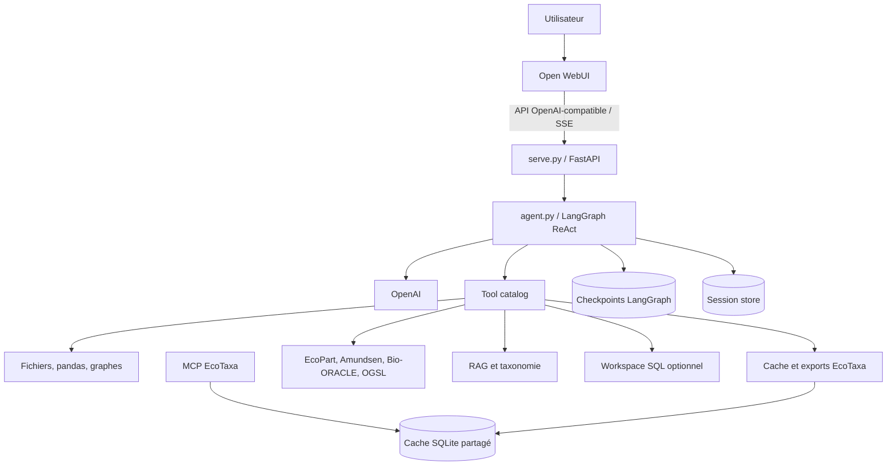
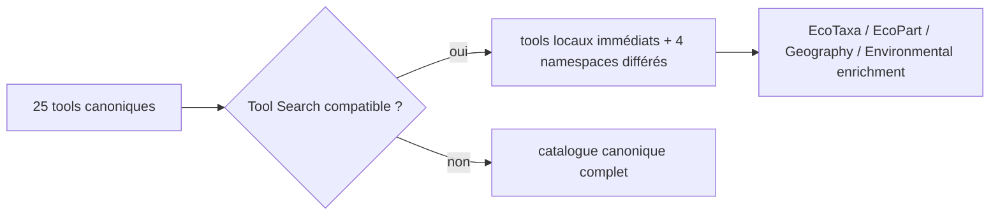
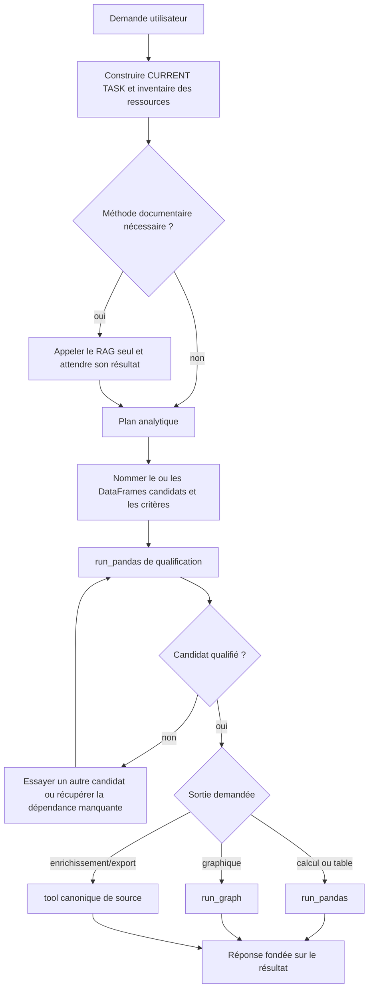

# Architecture simplifiée — IDEA

Ce document présente les composants réellement actifs et leur circulation de
données. Le périmètre fonctionnel est résumé dans [PRESENTATION.md](PRESENTATION.md)
et les fonctions disponibles dans [TOOLS.md](TOOLS.md).

## Vue d’ensemble


```mermaid
flowchart TB
    U["Utilisateur"] --> OW["Open WebUI"]
    OW -->|"API OpenAI-compatible / SSE"| API["serve.py / FastAPI"]
    API --> AG["agent.py / LangGraph ReAct"]
    AG --> LLM["OpenAI"]
    AG --> CAT["Tool catalog"]
    AG --> CKPT[("Checkpoints LangGraph")]
    AG --> STORE[("Session store")]
    CAT --> FILES["Fichiers, pandas, graphes"]
    CAT --> ECO["Cache et exports EcoTaxa"]
    CAT --> ENRICH["EcoPart, Amundsen, Bio-ORACLE, OGSL"]
    CAT --> KNOW["RAG et taxonomie"]
    CAT --> SQL["Workspace SQL optionnel"]
    MCP["MCP EcoTaxa"] --> CACHE[("Cache SQLite partagé")]
    ECO --> CACHE
```

IDEA utilise un seul agent ReAct. Il n’existe ni mode de session, ni planner
séparé, ni chargeur de skills. Le plan analytique est produit par le même modèle
dans la boucle ReAct, puis vérifié par les résultats des tools.

## Les quatre couches

### 1. Interface et transport

`serve.py` expose une API OpenAI-compatible consommée par Open WebUI.

| Route | Rôle |
|---|---|
| `GET /` | santé du service |
| `GET /v1/models` | modèle IDEA exposé à Open WebUI |
| `POST /v1/chat/completions` | conversation et streaming SSE |
| `GET /graphs/{filename}` | graphiques PNG |
| `GET /downloads/{filename}` | exports et livrables |
| `GET /debug/context-audit` | dernière projection du contexte modèle |
| `GET /debug/harness-trace` | trace du tour courant |
| `GET /debug/harness-turns` | chronologie bornée des contextes, décisions et tools par tour |

La couche transport traduit les messages Open WebUI, diffuse les appels et
résultats de tools, puis héberge les artefacts locaux.
Lorsqu'un appel Pandas est une lecture exacte de DataFrame (`result = df_*`),
son aperçu tabulaire est également diffusé directement : une réponse finale
qui dit seulement « affiché » ne peut plus laisser l'interface vide.

### 2. Agent et état LangGraph

`agent.py` construit le catalogue puis appelle `create_agent` :

```python
catalog = build_tool_catalog(thread_id)
agent = create_agent(model, list(catalog.tools), ...)
```

Deux mécanismes préparent chaque appel modèle :

- `ExplorationStateMiddleware` conserve objectif, livrables, ressources,
  étapes, dépendances et preuves dans le checkpoint LangGraph;
- `_ContextMiddleware` construit le contexte transitoire, compacte l’historique,
  borne les résultats de tools et choisit leur représentation côté provider;
- `core/context_projection.py` reçoit les blocs nommés du tour et produit une
  projection budgétée avec un ledger de tokens. Le plafond couvre ensemble le
  système, les schémas de tools, le contexte transitoire, l’historique et la
  réserve de sortie.

Le contexte transitoire est organisé ainsi :

```text
SYSTEM MESSAGE stable
historique utile
application_turn_context
  CURRENT TASK
  profil métier éventuel
  AVAILABLE DATAFRAMES
  faits du dernier graphique
  EXPLORATION FRONTIER
  directive de récupération après erreur, si nécessaire
demande utilisateur originale
appels et résultats ReAct du tour
schémas de tools transmis séparément
```

`CURRENT TASK` contient aussi une capsule utilisateur bornée par son budget de
caractères. Elle réserve les quatre premières instructions comme ancrage de la
demande, puis utilise le budget restant pour les instructions les plus récentes;
l'ensemble est rendu clairement dans l'ordre chronologique de chaque groupe.
Les réponses de l'assistant en sont exclues : les contraintes multi-tours
survivent ainsi à la compaction sans promouvoir une ancienne affirmation du
modèle au rang de fait.

Les DataFrames transitoires appartenant encore au working set sont rafraîchis
uniquement lorsqu'un résultat de tool ou une référence utilisateur exacte les
justifie. Une table orpheline continue donc de vieillir, tandis qu'une table de
correspondances encore soutenue par les preuves structurées reste visible dans
les tours de suivi.

Le message système reste stable et cacheable. Les données propres au tour ne
sont pas ajoutées durablement au checkpoint comme instructions système.
Avec OpenAI compatible, un breakpoint explicite termine ce préfixe stable et
la clé versionnée est calculée depuis le modèle, le system prompt et la surface
de tools réellement déclarée. Les reprises ReAct conservent la même surface
Tool Search; les tools différés sont retrouvés dans leur namespace au lieu de
modifier le contrat cacheable.

Le moniteur distingue `cacheable_prefix_tokens`, les schémas de tools, les
tokens de chaque bloc dynamique et les résultats de tools du tour courant. Un
résultat persistant déjà observé par le modèle peut être compacté dans la copie
provider lorsqu'un résumé structuré complet existe; le checkpoint, le dernier
lot non observé, les erreurs et les blocages restent intacts.

### 3. Catalogue et exécution des tools

`tools/tool_catalog.py` est la source de vérité du runtime :

- 22 tools obligatoires;
- 3 tools SQL ajoutés seulement si `DATABASE_URL` est valide;
- noms uniques, schémas d’entrée stricts et politiques explicites;
- résultats structurés `ToolResult`;
- labels français/anglais pour l’interface.

Le `ToolNode` LangGraph conserve toujours les vraies fonctions exécutables.
Seule leur présentation au provider change :


```mermaid
flowchart LR
    C["25 tools canoniques"] --> Q{"Tool Search compatible ?"}
    Q -->|"oui"| D["tools locaux immédiats + 4 namespaces différés"]
    Q -->|"non"| F["catalogue canonique complet"]
    D --> N["EcoTaxa / EcoPart / Geography / Environmental enrichment"]
```

Avec OpenAI Tool Search, les schémas spécialisés sont chargés à la demande.
Une capacité différée reste disponible même si son schéma détaillé n’apparaît
pas initialement. Sans Tool Search, aucun filtre lexical ne retire de capacité.

La `SourceDecision` est une préférence contextuelle, jamais une autorisation :
elle aide le modèle à choisir une source, mais ne bloque pas la récupération
d’une table ou colonne manquante dans une autre source pertinente.

### 4. Données et sources

| Ressource | Accès |
|---|---|
| Fichiers utilisateur | `load_file`, workspace pandas persistant |
| EcoTaxa | cache SQLite read-only et exports confirmés |
| EcoPart | correspondance, aperçu et enrichissement distant |
| Amundsen CTD | disponibilité, profils appariés et enrichissement |
| Bio-ORACLE | enrichissement guidé d’un DataFrame |
| OGSL | enrichissement CTD d’un DataFrame |
| Géographie | registre de zones IHO/MEOW |
| RAG | index ChromaDB de 14 documents métier |
| Taxonomie | RAG local, WoRMS, puis Wikipedia en fallback |
| SQL | base externe read-only optionnelle |

L’agent IDEA et le service MCP EcoTaxa partagent le même cache SQLite. IDEA
appelle directement les fonctions Python du cœur EcoTaxa; le serveur MCP HTTP
permet principalement l’accès à d’autres agents et l’administration du cache.

## Flux d’une analyse


```mermaid
flowchart TD
    A["Demande utilisateur"] --> B["Construire CURRENT TASK et inventaire des ressources"]
    B --> C{"Méthode documentaire nécessaire ?"}
    C -->|"oui"| R["Appeler le RAG seul et attendre son résultat"]
    C -->|"non"| P["Plan analytique"]
    R --> P
    P --> D["Nommer le ou les DataFrames candidats et les critères"]
    D --> Q["run_pandas de qualification"]
    Q --> V{"Candidat qualifié ?"}
    V -->|"non"| X["Essayer un autre candidat ou récupérer la dépendance manquante"]
    X --> Q
    V -->|"oui"| E{"Sortie demandée"}
    E -->|"calcul ou table"| PA["run_pandas"]
    E -->|"graphique"| GR["run_graph"]
    E -->|"enrichissement/export"| ST["tool canonique de source"]
    PA --> Z["Réponse fondée sur le résultat"]
    GR --> Z
    ST --> Z
```

La qualification vérifie le grain, les colonnes requises, les clés, le
périmètre, les doublons et la nullité utile. Elle renvoie une petite preuve et
ne produit ni graphique ni table persistée. Le calcul final n’est exécuté
qu’après lecture de cette preuve.

## Gestion des DataFrames

Chaque table persistée reçoit un nom `df_*` et une fiche de ressource :

- source et parents;
- description générée ou déterministe;
- grain et portée;
- colonnes regroupées par rôle et type;
- clés, filtres, transformations et fraîcheur;
- dernier usage et statut actif, utilisés seulement comme indices.

`agents/context_working_set.py` reconstruit un `FactLedger` depuis les résultats
de tools réellement retournés et les fiches de ressources. Son `WorkingSet`
épingle d'abord les références exactes, les résultats produits ou consommés et
leurs parents déclarés. Il n'infère aucun plan par classement lexical. Le
pointeur actif est seulement un fallback. Les cartes suivent l'autorité
`tool > ressource > ancienne prose assistant`, partagent un budget de douze
fiches détaillées et conservent toujours l'index complet.
Un résultat de tool n'est `primary` que pendant le tour où il est produit. Au
tour utilisateur suivant, il reste une ressource récente réutilisable; seul un
nom explicitement cité par l'utilisateur peut alors redevenir `primary`.

Les fichiers chargés, exports, résultats de cache et enrichissements sont des
ancres durables. Les dérivés intermédiaires inutilisés sont masqués après six
tours et supprimés après vingt, sauf s’ils restent nécessaires à une lignée
visible. Toutes les tables conservées restent présentes dans l’index compact.

`query_ecotaxa_cache` peut monter temporairement des DataFrames explicitement
cités dans `dataframe_refs` comme tables SQLite en mémoire. Le cache EcoTaxa
reste attaché en lecture seule; la base temporaire disparaît après le `SELECT`,
et seul le résultat avec sa requête et sa lignée est persisté.

## Persistance

| Support | Contenu |
|---|---|
| Checkpointer LangGraph | messages et état d’exploration par `thread_id` |
| Session store | DataFrames, métadonnées, lignées et artefacts |
| PostgreSQL | backend partagé lorsque `SESSION_STORE_DATABASE_URL` est configuré |
| Fichiers locaux | fallback du session store |

Le même `chat_id` reprend les ressources persistées après un redémarrage. Une
nouvelle conversation ne réutilise pas automatiquement les tables d’une autre.

## Récupération après erreur

Une erreur de variable, table ou colonne devient une dépendance d’exploration.
L’agent reçoit le diagnostic structuré, retrouve la ressource pertinente, puis
reprend l’étape qui a échoué. Il ne doit ni demander inutilement les données à
l’utilisateur, ni remplacer silencieusement la métrique ou le périmètre.

## Composants principaux

| Fichier ou module | Responsabilité |
|---|---|
| `serve.py` | API, SSE, images et téléchargements |
| `agent.py` | agent, contexte, modèle et guards |
| `core/context_projection.py` | projection transitoire structurée, priorités et ledger de tokens |
| `agents/context_working_set.py` | FactLedger et WorkingSet factuels des DataFrames |
| `agents/copepod_system_prompt.py` | comportement permanent |
| `agents/exploration_middleware.py` | état d’exploration |
| `tools/tool_catalog.py` | catalogue exécutable et politiques |
| `tools/openai_tool_search.py` | projection Tool Search |
| `tools/data_tools.py` | fichier, pandas et graphes |
| `tools/copepod_sources.py` | cache et exports EcoTaxa |
| `tools/ecopart_sources.py` | correspondance et enrichissement EcoPart |
| `tools/amundsen_sources.py` | Amundsen CTD |
| `tools/bio_oracle_sources.py` | Bio-ORACLE |
| `tools/ogsl_sources.py` | OGSL |
| `tools/resource_inventory.py` | inventaire et profils de DataFrames |
| `tools/session_store*.py` | persistance des ressources |
| `core/copepod_rag/` | base documentaire métier |
| `core/mcp/` | serveur MCP EcoTaxa |

## Décisions structurantes

1. Un seul agent ReAct, sans mode ni sous-agent obligatoire.
2. Le choix du dataset appartient au plan de l’agent, pas au DataFrame actif.
3. Une préférence de source guide sans filtrer les capacités.
4. Le RAG porte le savoir; les tools portent les données et les calculs.
5. Tous les résultats numériques viennent d’une exécution ou d’une source.
6. Les opérations lourdes demandent une confirmation explicite.
7. Le catalogue ne contient que des tools canoniques exécutables.

## Configuration essentielle

| Variable | Rôle |
|---|---|
| `OPENAI_API_KEY` | accès au modèle |
| `LLM_MODEL` | modèle OpenAI |
| `OPENAI_TOOL_SEARCH_ENABLED` | namespaces différés compatibles OpenAI |
| `MAX_CONTEXT_TOKENS` | plafond de contexte |
| `MAX_PROVIDER_HISTORY_TOKENS` | plafond de l’historique brut ancien (le tour ReAct courant reste entier dans le plafond global) |
| `MAX_CHECKPOINT_MESSAGES` | plafond durable de messages LangGraph; défaut 40, le transcript complet reste dans Open WebUI |
| `MAX_LIVE_DERIVED_DATAFRAMES` | plafond de dérivés visibles; défaut 20, hors fichiers et sources durables |
| `MAX_TOOL_RESULT_CHARS` | borne des observations |
| `HARNESS_TRACE_MAX_TURNS` | nombre de tours de monitoring conservés en mémoire |
| `CHECKPOINTS_DB` | checkpoints SQLite |
| `SESSION_STORE_DATABASE_URL` | session store PostgreSQL optionnel |
| `DATABASE_URL` | workspace SQL read-only optionnel |
