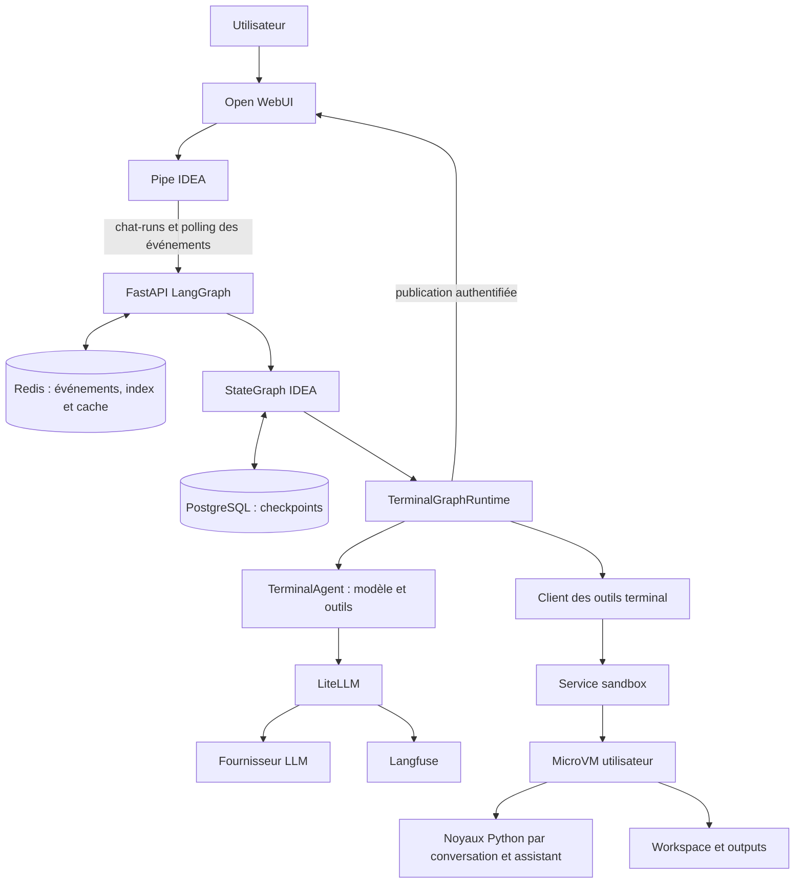
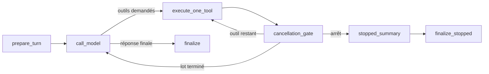

# Architecture du dépôt IDEA actuel

Cartographie issue de la lecture du code le 11 septembre 2026. Socle Hawaii :
`5b1322dbe68fefd31fc1de29a076b1746a36c5d7` (`next-dev`), avec les documents
NeoLab ajoutés localement. Cette carte décrit l'implémentation présente ; elle
ne constitue pas une preuve de fonctionnement sur notre infrastructure.
Les connecteurs NeoLab de l'archive ne sont pas encore intégrés.

## 1. Parcours de lecture pour les agents

Lire dans cet ordre :

1. [AGENTS.md](AGENTS.md) : règles de contribution NeoLab.
2. Ce document : composants, flux et frontières d'état.
3. [Plan de migration](docs/NEOLAB_MIGRATION.md) : étapes et critères de validation.
4. Les fichiers du sous-système concerné, indiqués dans les tables ci-dessous.
5. Ses tests, avant de modifier un comportement.

Les noms de fonctions sont fournis pour retrouver les points d'entrée avec
`rg`. Les documents upstream de suivi peuvent décrire un état plus ancien :
en cas de contradiction, vérifier le code et la configuration réellement chargée.

## 2. Vue d'ensemble

IDEA est un assistant de programmation et d'analyse scientifique. Le modèle
choisit ses outils ; le runtime exécute le Python dans un environnement séparé,
transmet les observations et conserve une mémoire d'exécution. La spécialisation
métier vient des instructions, skills et outils dédiés.

```mermaid
flowchart TD
    User[Utilisateur] --> OW[Open WebUI]
    OW --> Pipe[Pipe IDEA]
    Pipe -->|chat-runs et polling des événements| API[FastAPI LangGraph]
    API <--> Redis[(Redis : événements, index et cache)]
    API --> Graph[StateGraph IDEA]
    Graph <--> PG[(PostgreSQL : checkpoints)]
    Graph --> Runtime[TerminalGraphRuntime]
    Runtime --> Agent[TerminalAgent : modèle et outils]
    Agent --> Proxy[LiteLLM]
    Proxy --> Provider[Fournisseur LLM]
    Proxy --> LF[Langfuse]
    Runtime --> HTTP[Client des outils terminal]
    HTTP --> Sandbox[Service sandbox]
    Sandbox --> VM[MicroVM utilisateur]
    VM --> Kernel[Noyaux Python par conversation et assistant]
    VM --> Files[Workspace et outputs]
    Runtime -->|publication authentifiée| OW
```

Ce diagramme représente le chemin principal du modèle conversationnel. Certains
outils auxiliaires ont leur propre appel LLM et ne suivent pas nécessairement
la même route de proxy. Le service LangGraph exécute aussi les outils de
documentation et de données qui n'ont pas besoin du noyau.

## 3. Carte des répertoires

| Chemin | Responsabilité | Lire en premier |
|---|---|---|
| `langgraph/` | API agent, modèle, graphe, mémoire, outils et documentation métier | [langgraph_service.py](langgraph/langgraph_service.py) |
| `langgraph/agents/` | Construction du modèle, outils, synchronisation des fichiers ; boucle alternative | [terminal_agent.py](langgraph/agents/terminal_agent.py) |
| `langgraph/idea_graph/` | Boucle checkpointée, état sérialisable, exécution et interruption | [graph.py](langgraph/idea_graph/graph.py), [runtime.py](langgraph/idea_graph/runtime.py) |
| `langgraph/tools/` | Client HTTP du service sandbox et schémas d'outils d'exécution | [persistent_terminal.py](langgraph/tools/persistent_terminal.py) |
| `langgraph/utils/` | Prompt, skills, publication et outils métier | [system_prompt.md](langgraph/utils/system_prompt.md) |
| `langgraph/utils/pqa/` | Synchronisation des bibliothèques et index PaperQA | [openwebui_library.py](langgraph/utils/pqa/openwebui_library.py) |
| `langgraph/utils/skills/` | Instructions métier/techniques, skills plats et packages hiérarchiques | [skill_loader.py](langgraph/utils/skill_loader.py) |
| `langgraph/db/` | Initialisation PostgreSQL des checkpoints ; ancien CRUD encore présent | [setup_langgraph_db.sh](langgraph/db/setup_langgraph_db.sh) |
| `sandbox_service/` | Propriétaire des sessions d'exécution et microVM | [main.py](sandbox_service/main.py), [terminal_registry.py](sandbox_service/terminal_registry.py) |
| `interpreter_kernel/` | Image invitée, daemon Python, client et runtime Codex | [README.md](interpreter_kernel/README.md), [daemon.py](interpreter_kernel/daemon.py) |
| `interpreter_kernel/interpreter/` | Code Open Interpreter embarqué, dont moteur Jupyter | [python.py](interpreter_kernel/interpreter/core/computer/terminal/languages/python.py) |
| `interpreter_kernel/modules/` | Dépendances originales et scientifiques, dont fichiers verrouillés | [DEPENDENCY_AUDIT.md](interpreter_kernel/DEPENDENCY_AUDIT.md) |
| `openwebui/` | Image UI, fonction Pipe et scripts de configuration | [idea_pipe.py](openwebui/functions/idea_pipe.py) |
| `assistants/` | Catalogue d'assistants, prompts Welcome/SEA/Mars, images et déploiement UI | [manifest.json](assistants/manifest.json) |
| `shared_data/` | Import/synchronisation de données scientifiques communes autorisées | [manifest.toml](shared_data/manifest.toml), [sync_shared_data.py](shared_data/sync_shared_data.py) |
| `litellm/` | Alias modèles, routage fournisseur, budgets, cache et traces | [litellm_config.yaml](litellm/litellm_config.yaml) |
| `langfuse/` | Initialisation du stockage de l'observabilité | [setup_langfuse_db.sh](langfuse/setup_langfuse_db.sh) |
| `tests/` | Tests ciblés des contrats agent, mémoire, UI, données et fichiers | Voir section tests |
| `docs/` | Déploiement, notes upstream et plan NeoLab | [Quick-Deploy.md](docs/Quick-Deploy.md) |
| `scripts/` | Maintenance du certificat de production | [renew-production-cert.sh](scripts/renew-production-cert.sh) |
| `.github/workflows/` | Déploiement, monitoring et fabrication de l'image microVM | [deploy.yml](.github/workflows/deploy.yml) |
| Racine | Compose, Nginx, exemple d'environnement et documentation | [docker-compose.yml](docker-compose.yml), [example.env](example.env) |

L'interface Open WebUI complète n'est pas maintenue en sources dans ce dépôt :
son Dockerfile part d'une image Hawaii épinglée et applique un patch ciblé.
Open Terminal est également une dépendance de l'image invitée. Une modification
de leur code amont ne se fait donc pas automatiquement dans ces répertoires.

## 4. Du message utilisateur à la réponse

### Transport principal

Dans [idea_pipe.py](openwebui/functions/idea_pipe.py), `Pipe` collecte les
messages, l'assistant choisi, les fichiers, l'identité et l'autorisation Open
WebUI. `_structured_messages` prépare l'historique et retire/borne certaines
sorties techniques déjà affichées. Les références de checkpoint permettent de
reprendre le bon historique, notamment lors des branches/régénérations.

Le Pipe crée un job avec `POST /chat-runs`, puis lit les événements avec un
curseur. Le serveur lance `_run_chat_job` dans un thread et stocke les événements
dans Redis. Redis sert ici de transport récupérable et de registre de statut,
pas de moteur de calcul ni de file de workers indépendante du processus.

| Route LangGraph | Rôle |
|---|---|
| `GET /health` | Santé du service |
| `POST /chat-runs` | Démarrer un job |
| `GET /chat-runs/{run_id}` | Lire son statut |
| `GET /chat-runs/{run_id}/events?after=...` | Lire les événements après un curseur |
| `POST /chat-runs/{run_id}/stop` | Demander l'arrêt |
| `POST /chat` | Route alternative avec streaming SSE direct et orchestrateur manuel |
| `POST /clear` | Nettoyage de session ; lire l'implémentation avant usage |

`INTERNAL_SERVICE_TOKEN` protège les routes internes concernées quand il est
configuré. L'authentification utilisateur vient du Pipe ; ce service n'est pas
une API publique autonome à exposer sans cette frontière.

### Construction du graphe

Avec `IDEA_AGENT_RUNTIME=langgraph`, `_run_chat_job` :

1. Dérive les identifiants et résout le checkpoint correspondant aux messages.
2. Crée `RunCancellation`, `TerminalGraphRuntime` et le checkpointer.
3. Construit `build_idea_graph(...)` et appelle `graph.invoke(...)`.
4. Enregistre les références du nouveau checkpoint et la consommation du tour.

```mermaid
flowchart LR
    P[prepare_turn] --> M[call_model]
    M -->|outils demandés| T[execute_one_tool]
    T --> C[cancellation_gate]
    C -->|outil restant| T
    C -->|lot terminé| M
    M -->|réponse finale| F[finalize]
    C -->|arrêt| S[stopped_summary]
    S --> FS[finalize_stopped]
```

Les outils d'un même lot sont exécutés successivement. Le graphe garde un
registre des actions et des exécutions Python, borne les répétitions identiques
et conserve une continuation en cas d'arrêt. Les checkpoints sont des points
de reprise ; ils ne rendent pas atomiques un téléchargement externe, une
écriture de fichier et une transaction PostgreSQL.

### Rôles des classes

| Composant | Ce qu'il possède |
|---|---|
| `TerminalAgent` | `ChatOpenAI(...).bind_tools(...)`, outils liés à l'utilisateur, fichiers et fonctions partagées avec la boucle alternative |
| `TerminalGraphRuntime` | Projection du contexte, appels modèle, dispatch des outils, code archivé, images, finalisation |
| `IDEAState` | Messages, objectif, actions, exécutions, artefacts, identifiants et continuation sérialisables |
| `RunCancellation` | Signal d'arrêt vivant, hors checkpoint |
| `ConversationOrchestrator` | Boucle alternative dans `multi_agent.py`, contexte et historique Redis associés |

Le nom `multi_agent.py` ne signifie pas que le chemin principal est un système
de plusieurs agents conversationnels. Codex peut être délégué comme outil de
programmation ; d'autres outils font des appels LLM auxiliaires.

## 5. Modèle, instructions et outils

### Modèle

[idea_config.py](langgraph/idea_config.py) définit les profils standard/advanced,
les modèles auxiliaires et les limites. `TerminalAgent` appelle le proxy LiteLLM
avec une clé virtuelle ; le proxy résout l'alias vers le fournisseur. Le profil
advanced active l'API Responses. Ces profils sont des choix upstream, pas une
validation du fournisseur que NeoLab utilisera.

Examiner ensemble la configuration Python, `example.env`, Compose et
`litellm/litellm_config.yaml`. Les outils station et recherche web utilisent
`litellm.responses` avec `OPENAI_BASE_URL`/`OPENAI_API_KEY` directement dans leur
code : le nom de la bibliothèque ne prouve pas un passage par le proxy local.
PaperQA et Codex ont aussi leurs paramètres. Tester chaque route utilisée.

### Instructions

`compose_system_prompt` compose le prompt général, la spécialisation reçue
d'Open WebUI et le manifeste des skills intégrés. Les textes complets des skills
sont chargés par `view_skill` lorsque nécessaire. Le chargeur distingue :

- skills intégrés dans `langgraph/utils/skills/` ;
- skills Workspace Open WebUI récupérés par API ;
- packages intégrés avec routes, composants, dépendances et budgets d'octets.

Ces fichiers sont des ressources de l'agent applicatif. Ils ne sont pas des
instructions automatiquement applicables à l'agent de développement qui lit ce dépôt.

### Surface d'outils

| Famille | Outils / point de construction |
|---|---|
| Exécution | `run_python_tool`, `run_terminal_tool`, `restart_terminal_tool` |
| Fichiers | `write_file_tool`, `publish_artifact_tool`, `read_output_range_tool` |
| Images | `show_image_tool`, `inspect_image_tool` |
| Procédures | `view_skill` |
| Métier/découverte | `get_datetime_tool`, `get_station_info_tool`, `web_search_tool`, `get_climate_indices_tool` |
| Documentation optionnelle | `query_knowledge_base` via la fabrique PaperQA |
| Programmation optionnelle | `delegate_to_codex` si configuration disponible |

L'assemblage autoritatif est `TerminalAgent.all_tools` et `tools_by_name`.
`DATA_TOOLS` ne représente qu'une partie du catalogue. Les fonctions grep/glob
existent côté environnement mais ne sont pas ajoutées au catalogue principal
dans le constructeur inspecté. Il n'y a pas ici le catalogue NeoLab de 22 outils
ni son mécanisme de Tool Search.

## 6. Données, Python et stockage

### Accès aux données

- `_sync_inputs_from_openwebui` autorise et copie les pièces jointes vers
  `/workspace/uploads`, avec vérification de taille/transfert. Les chemins
  sont fournis au modèle, qui choisit le lecteur Python.
- Le Python peut charger des fichiers ou des sources réseau selon les
  instructions métier. SEA décrit par exemple des requêtes ERDDAP.
- L'outil climatique normalise les séries côté service et écrit directement
  un CSV et un JSON de provenance dans le workspace. Il retourne des références.
- `/app/data` dans la microVM expose les données scientifiques partagées en
  lecture seule ; ce n'est pas le répertoire PaperQA du service LangGraph.

### Exécution

`persistent_terminal.py` appelle le service sandbox par HTTP. Celui-ci résout
la session via `terminal_registry.py`, puis `MicrosandboxTerminal` exécute dans
la microVM. Python passe par `interpreter_kernel/client.py` et `daemon.py`,
qui maintient les runners IPython par `kernel_id` avec des verrous d'exécution.
Les commandes shell ont leur propre voie ; un script Python lancé par shell
n'est pas une cellule du noyau persistant.

`run_python_tool` sert au chargement, calcul et graphique. Le runtime archive
le code sous `/workspace/.idea/threads/<thread>/executions/<execution>.py`,
capte console et images, puis inspecte les noms définis par le code réussi.
L'inspection renvoie nom, type, shape et longueur éventuelle, pas toutes les
valeurs ni un contrat scientifique complet.

### Frontières de persistance

| État | Support | Portée et limite |
|---|---|---|
| Variables/DataFrames/imports | RAM du noyau | Par défaut utilisateur + chat + assistant ; perdus si noyau détruit |
| Fichiers de travail | `/workspace` dans la microVM | Espace utilisateur, partagé entre ses conversations |
| Livrables locaux | `/outputs` dans la microVM | Publication vers Open WebUI séparée de leur création |
| Actions et mémoire du graphe | PostgreSQL via `PostgresSaver` | Thread dérivé de l'utilisateur/chat, références de branches gérées côté service |
| Checkpoints sans DSN | `InMemorySaver` | Non durables au redémarrage du processus |
| Événements, statut, correspondances de checkpoints | Redis | Transport/index, avec politiques de rétention propres |
| Chemin de sortie → ID Open WebUI | `ArtifactRegistry` dans Redis | Index de dernière version par utilisateur, pas stockage des octets |
| Fichiers publiés et conversation UI | Open WebUI | Autorisation et stockage gérés par Open WebUI |
| Bibliothèques/index PaperQA | Volume du service LangGraph | Scopes documentaires, hors mémoire Python de l'utilisateur |

`identities.py` dérive les identifiants côté serveur ; `IDEA_KERNEL_SCOPE` peut
modifier le périmètre du noyau. Ne pas confondre `workspace_id` logique avec
le `sandbox_id` que `TerminalAgent` lie à l'identité utilisateur.

Aucune sauvegarde automatique générale des DataFrames n'est mise en œuvre
dans le parcours étudié. `DatasetRecord` est un type déclaré dans l'état, pas
la preuve d'un registre alimenté pour toutes les tables. Les anciennes fiches
de namespace sont des observations historiques, pas une inspection fraîche
de tout le noyau à chaque tour. Un redémarrage exige de requalifier/recharger.

## 7. Contexte et reprise

`TerminalGraphRuntime.model_messages` assemble : prompt système, mémoire
d'exécution passée, conversation reçue, transcript d'outils du tour et images
nouvelles. `prepare_turn` remplace le transcript brut du tour précédent ; les
exécutions utiles restent dans les registres et les checkpoints historiques.

Valeurs par défaut dans `idea_config.py` :

| Paramètre | Valeur | Rôle |
|---|---|---|
| `IDEA_MAX_RECENT_EXECUTIONS` | 20 | Nombre maximal d'exécutions dans le registre courant |
| `IDEA_MAX_RECENT_ACTIONS` | 50 | Nombre maximal d'actions courantes |
| `IDEA_MAX_STATE_BYTES` | 524288 | Budget réparti entre registres Python/actions ; pas plafond universel de tout l'état |
| `IDEA_MAX_EXECUTION_MEMORY_BYTES` | 48000 | Mémoire d'exécution projetée vers le modèle |
| `IDEA_MAX_MODEL_TOOL_OBSERVATION_BYTES` | 6000 | Observation d'outil visible |
| `IDEA_MAX_MODEL_HISTORY_MESSAGE_BYTES` | 16000 | Borne appliquée dans la préparation de l'historique UI concerné |

`execution_memory_block` sélectionne par défaut huit exécutions et huit actions
passées, dans son budget. Il expose références du code, statut, variables,
artefacts et extraits de résultat. Cela ne remplace pas un inventaire complet
des DataFrames, de leurs colonnes ou de leur lignée.

La configuration Open WebUI possède également une compaction de contexte.
Ne pas attribuer au graphe une garantie de budget global en tokens sur la seule
base de ces plafonds en octets. La mémoire, l'historique UI et les checkpoints
se complètent mais peuvent perdre des détails différents.

## 8. Publication et vision

`publish_artifact_tool` copie un fichier régulier de `/workspace` vers `/outputs`.
La synchronisation compare les signatures de fichiers et envoie les sorties à
Open WebUI avec l'autorisation de l'utilisateur. `ArtifactRegistry` conserve
les correspondances entre chemins, signatures et IDs publiés, avec protection
contre l'écrasement d'une version récente par une synchronisation plus lente.

Les liens `sandbox:/outputs/...` sont des placeholders : le Pipe les résout
en liens Open WebUI. Le modèle ne doit pas fabriquer les URL finales. Les
figures Python peuvent être synchronisées pendant le tour ; leurs pixels sont
aussi fournis à la prochaine itération du modèle. Les utilitaires de
`output_sync.py` identifient les fichiers modifiés et les dépendances HTML.

Pour un problème « fichier créé mais invisible », suivre successivement :
création noyau → chemin `/outputs` → synchronisation authentifiée → registre
d'artefacts → résolution du lien par le Pipe.

## 9. Documentation métier et Codex

PaperQA est optionnel. `openwebui_library.py` récupère les documents autorisés,
normalise les formats pris en charge en PDF, suit leurs empreintes et construit
des scopes de bibliothèque. `pqa_multi_tenant.py` gère index et paramètres sur
disque ; `knowledge_base_tool.py` expose la requête et ses citations/avertissements.
Ce chemin ne correspond pas au ChromaDB copépodes de l'archive.

Codex est un outil subordonné : `make_codex_tool`, le dispatch dans `runtime.py`,
le service sandbox et `interpreter_kernel/codex_runner.py` coopèrent pour
exécuter la tâche dans le workspace. Les threads Codex et leur consommation
sont suivis dans l'état. Le raccordement utilise ses paramètres propres ;
l'accès du modèle principal ne prouve pas celui de Codex depuis la microVM.
Voir [Codex-Integration.md](docs/Codex-Integration.md).

## 10. Déploiement et configuration

| Service Compose | Rôle |
|---|---|
| `db` | PostgreSQL, rôles/schémas séparés pour services |
| `redis` | Événements, index applicatifs et cache LiteLLM |
| `langgraph` | API agent, port interne 8010 |
| `sandbox` | API d'exécution, port interne 8020, gestion microsandbox |
| `shared-data` | Opérations d'import/synchronisation du volume scientifique |
| `litellm` | Proxy modèles, stockage de consommation et callbacks |
| `langfuse` | Observabilité LLM |
| `openwebui` | Interface et stockage utilisateur |
| `nginx` via overlays | Routage HTTP/HTTPS |

Le Dockerfile LangGraph construit le service Python séparément de l'image du
noyau. Modifier le code embarqué dans la microVM exige de reconstruire son image
et de gérer les environnements existants ; redémarrer le conteneur LangGraph
ne met pas à jour leurs dépendances.

- `docker-compose.override.yml` : ports/montages de développement et Nginx.
- `docker-compose.prod.yml` : configuration réelle de production, dont ressources
  sandbox et Nginx HTTPS ; contrairement à une phrase du README upstream, il
  n'est pas vide. Ses domaines/certificats appartiennent au déploiement Hawaii.
- `docker-compose.next-dev.yml` : surcharge propre à cet environnement.
- `docker-compose.file-uploads-local.yml` : variante de test des uploads UI.
- `nginx*.conf` : routage et variantes HTTPS.

Les scripts d'initialisation dans `litellm/`, `langgraph/db/` et `langfuse/`
préparent leurs bases. Les scripts Open WebUI enregistrent la fonction Pipe,
configurent les paramètres persistés dans l'UI et déploient les assistants.
Une édition locale du Pipe n'enregistre pas automatiquement sa nouvelle version
dans la base Open WebUI.

La cible microVM et les contraintes KVM doivent être vérifiées sur le serveur.
Les fichiers des microVM résident dans les overlays sous `/root/.microsandbox`,
montés sur `idea_microsandbox_data`. Un arrêt/reprise conserve normalement les
fichiers ; une destruction de VM les supprime. `refresh_sandboxes.sh` est une
opération de remplacement destructive, pas un simple redémarrage.

| Volume | Contenu |
|---|---|
| `app-db-data` | PostgreSQL |
| `idea_redis_data` (base), `redis_data` (override) | Persistance Redis selon le Compose effectif |
| `idea_openwebui_data` | Données Open WebUI |
| `idea_microsandbox_data` | Images, état et disques microVM |
| `idea_shared_data` | Données scientifiques communes |
| `idea_paperqa_data` | Bibliothèques et index PaperQA du service LangGraph |

La base publie déjà Open WebUI sur 3001 et Redis sur le port loopback 6380.
L'override ajoute notamment Nginx 80, LangGraph 8010, sandbox 8020, LiteLLM
8030, Langfuse 3050 et PostgreSQL loopback 5434. Vérifier la configuration
fusionnée avant de déduire les ports accessibles. Les montages `./frontend`
et `./static` de l'override désignent des dossiers absents du clone inspecté.

Le fallback shell local ne fournit pas le même contrat : le registre renvoie
une erreur pour Python persistant hors `MicrosandboxTerminal`. Il ne suffit
donc pas à valider les scénarios notebook NeoLab sur Mac.

## 11. Tests et chemins de diagnostic

| Sujet | Tests à consulter |
|---|---|
| Graphe, checkpoint, identité, mémoire | `tests/test_langgraph_memory.py` |
| Jobs, arrêt et progression | `tests/test_chat_run_events.py`, `test_model_cancellation.py`, `test_agent_progress.py` |
| Chargement et contexte documentaire | `tests/test_input_sync.py`, `test_langgraph_paperqa_prepare.py` |
| Artefacts et publication | `tests/test_artifact_registry.py`, `test_publish_artifact.py`, `test_output_sync.py`, `test_output_changes.py` |
| Images et HTML | `tests/test_vision.py`, `test_html_output_resources.py` |
| Skills et PaperQA | `tests/test_skill_loader.py`, `test_paperqa_tool.py`, `test_paperqa_openwebui_library.py` |
| Outils/données | `tests/test_climate_tool.py`, `test_shared_data.py` |
| UI/assistants | `tests/test_idea_pipe_assistants.py`, `test_configure_openwebui.py`, `test_deploy_assistants_openwebui.py` |
| Sorties terminal/Codex | `tests/test_terminal_output_archiving.py`, `test_codex_integration.py` |
| Sandbox | `sandbox_service/test_*.py` : concurrence, limites et interruption |
| Image invitée | `interpreter_kernel/smoke_test.py`, `test_image.sh`, `test_microsandbox_image.sh` |

La suite utilise notamment `unittest` et des doubles de runtime. Après
installation des dépendances adaptées, un point d'entrée est
`python -m unittest discover -s tests -p 'test_*.py'` ; lire les prérequis du
test ciblé. Les essais microVM sont séparés et nécessitent leur infrastructure.
Aucune de ces commandes n'a été exécutée pour produire cette cartographie.

Les workflows présents sont `deploy.yml`, `monitor.yml` et
`microsandbox-image.yml`. Leur présence ne prouve pas que tous les tests
conversationnels NeoLab sont exécutés en CI. Le déploiement upstream dépend
des branches/environnements et variables GitHub ; ne pas réutiliser ses
destinations pour NeoLab sans adaptation explicite.

## 12. Où intervenir pour NeoLab

| Besoin | Premier point d'entrée | Vérification associée |
|---|---|---|
| Raccorder notre modèle | Config Python + LiteLLM + Compose + profil UI | Appel réel avec outil et streaming |
| Ajouter un connecteur | `langgraph/utils/tools/`, puis assemblage `TerminalAgent` | Contrat déterministe et scénario réel |
| Écrire les données dans le workspace | Fabrique de l'outil climatique comme exemple | Fichier, provenance et référence lisible par Python |
| Ajouter les règles métier | Assistant dédié et skills ciblés | Comportement sur use case, pas seulement texte du prompt |
| Modifier le contexte/reprise | `idea_graph/runtime.py`, `memory.py`, `state.py`, Pipe | Multi-tour et perte/reprise de noyau |
| Modifier exécution/isolation | Service sandbox puis noyau invité | Tests sur l'image et backend réellement déployés |
| Corriger une sortie invisible | Synchronisation, registre et Pipe | Artefact ouvert depuis Open WebUI |

Pour chaque portage, suivre le [plan NeoLab](docs/NEOLAB_MIGRATION.md). Ne pas
faire dépendre le nouveau runtime du chemin de l'archive. Porter explicitement
les contrats scientifiques nécessaires plutôt que toutes les anciennes couches.

## 13. Pièges de lecture et limites établies

- `/chat-runs` avec runtime LangGraph et `/chat` avec orchestrateur alternatif
  sont deux chemins distincts. Le fallback Python de configuration est `manual`,
  alors que Compose et l'exemple choisissent `langgraph`.
- `langgraph/tools/msb_sandbox.py` est un pointeur de déplacement ; le code actif
  se trouve dans `sandbox_service/msb_sandbox.py`.
- `langgraph/db/conversation_crud.py` importe d'anciens modèles racine absents ;
  ce n'est pas la persistance canonique des checkpoints actuels.
- Les commentaires de fichiers et documents upstream peuvent être périmés.
- Les checkpoints gardent les références et observations, pas la RAM Python.
- Les scopes de fichiers, conversation, noyau et bibliothèque diffèrent.
- Un outil déclaré, un type d'état ou un test simulé ne prouve pas son usage réel
  ni sa fiabilité avec notre modèle.

Maintenir ce document lors d'un changement de flux, de persistance, de surface
d'outils ou de déploiement. Les résultats d'essais restent dans le journal de
migration ; ne pas les déduire de cette description statique.
