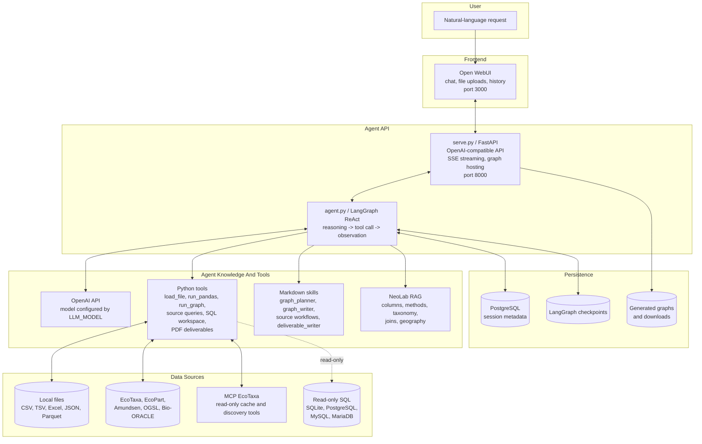

# Copepod Assistant Capabilities

This document explains what the assistant can do today, what is partial, and
what is not supported yet.

## Primary Use Cases

Stable today:

- Load, inspect, and analyse copepod-related tabular files.
- Produce static scientific graphs from loaded files or downloaded tables.
- Answer technical questions using the NeoLab knowledge base.

In active development:

- Explore EcoTaxa projects and samples through the local cache.
- Export selected EcoTaxa projects or samples for analysis.
- Integrate Amundsen CTD, OGSL, and Bio-ORACLE more tightly into the agent.
- Join biological observations with environmental data.
- Generate PDF deliverables from the current session.

## Agent And Tool Architecture



## Local Files

The assistant can load:

- CSV
- TSV
- Excel
- JSON
- Parquet
- UVP-style EcoTaxa and EcoPart exports

After loading a file, it can inspect columns, types, missing values, value
ranges, distributions, and likely semantic roles such as station, depth,
latitude, longitude, taxon, image ID, and morphometry fields.

## Data Analysis

The assistant can run controlled pandas analysis on active session data:

- filtering
- grouping
- aggregation
- derived variables
- table previews
- data quality checks
- missing-value checks
- duplicate checks
- simple joins
- abundance and biomass calculations when the required fields exist

Numeric claims should come from tool execution, not from free-form guessing.

## Graphs

The assistant can generate static PNG graphs with matplotlib. Generated images
are hosted by the agent API and displayed in Open WebUI.

Supported graph families include:

- vertical profiles
- station maps
- spatial gap maps
- taxonomic distributions
- time series
- depth-stratified summaries
- CTD profiles
- environmental overlays

Graph workflow:

1. `graph_planner`
2. `graph_writer`
3. `run_graph`

Current limitation: graph output is PNG only. Interactive Plotly/HTML graphs are
not implemented yet.

## EcoTaxa

EcoTaxa support is in active development. The assistant can currently:

- list accessible projects
- preview a project
- inspect project schema and column distributions
- compare project schemas
- count taxa by project
- export project data by project ID, taxon, and status
- export one EcoTaxa sample by `sample_id`
- export selected samples from a project with `sample_ids`
- search projects, samples, and observations through the local MCP EcoTaxa cache
- filter by geographic bounding box, date range, and instrument when supported

The MCP EcoTaxa service keeps a local read-only cache for fast geographic and
temporal discovery. This exploration layer is still being tested and improved,
especially for project/sample discovery and sample-level export workflows.

## EcoPart

The assistant can:

- list EcoPart samples
- preview a sample
- export sample data
- join EcoPart profiles with EcoTaxa object data when matching IDs are available

## Amundsen CTD

Amundsen CTD integration is in development. Current tool coverage includes:

- list known datasets
- preview station/cast profiles
- extract temperature, salinity, oxygen, fluorescence, depth/pressure, and time
  fields when available

## OGSL

OGSL integration is in development. The current direction is to enrich loaded
station/time tables with OGSL CTD profiles from the Gulf of St. Lawrence and
report match quality using time and depth deltas.

## Bio-ORACLE

Bio-ORACLE integration is in development. Current tool coverage includes:

- list available variables and scenarios
- preview a variable at a point
- query current and future marine variables
- couple zooplankton rows with environmental variables using latitude and
  longitude columns

This area is partial because scenario coverage and end-to-end agent workflows
need more testing.

## SQL Workspace

The assistant can connect to read-only SQL databases:

- SQLite
- PostgreSQL
- MySQL
- MariaDB through the MySQL protocol

Supported operations:

- list tables and views
- inspect primary keys and foreign keys
- preview tables with filters
- copy limited query results into the session workspace as TSV

Write queries are not allowed.

## Knowledge Base

The assistant has a NeoLab-specific RAG knowledge base built from Markdown docs
under `core/copepod_rag/docs/`.

It covers:

- copepod domain concepts
- source-specific columns
- lab column conventions
- instrument columns
- taxonomy notes
- environmental joins
- calculation methods
- Arctic and northern Quebec geography
- online source guidance

Fresh environments must build the ChromaDB index once:

```bash
python core/copepod_rag/build_index.py
```

## Geographic Knowledge

The assistant recognizes common named regions such as:

- Baffin Bay
- Beaufort Sea
- Hudson Strait
- Ungava Bay
- James Bay
- Hudson Bay
- Labrador Sea
- Gulf of St. Lawrence
- Nunavik
- Arctic regions used in the project context

Named zones are resolved through the local geographic registry and MCP/cache
tools where applicable.

## Deliverables

The assistant can compile session material into a PDF deliverable:

- markdown sections
- figures
- sources
- method notes
- limitations

Output is generated with WeasyPrint. If PDF generation fails because native
libraries are missing, the tool can fall back to HTML.

## Persistence

Current persistence:

- Open WebUI conversation history
- LangGraph checkpoints per conversation
- PostgreSQL-backed runtime/session metadata
- local generated graph and download URLs

Session dataframes may need to be reloaded after some restarts, depending on the
runtime path and storage mode.

## Current Limitations

- No interactive Plotly/HTML graph workflow yet.
- No R code generation workflow.
- No production-grade multi-user quotas.
- No ULaval server deployment included in this local setup.
- No local LLM hosting; the agent currently depends on the OpenAI API.
- Bio-ORACLE and some long end-to-end workflows still need more UI testing.
- The ChromaDB RAG index is generated locally and is not committed.

## Good Example Requests

- "Load this TSV and list the columns."
- "Show the stations from this file on a map."
- "Filter the loaded stations to Baffin Bay and make a map."
- "List EcoTaxa samples in Baffin Bay for 2024."
- "Find EcoTaxa projects with UVP6 data."
- "Preview this EcoTaxa project schema."
- "Join the EcoTaxa export with EcoPart profile data."
- "Enrich this station table with OGSL CTD data."
- "Create a PDF report from the graph and methods used in this session."
