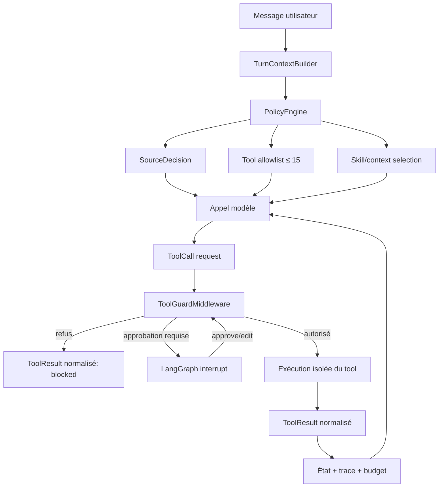

# Renforcement du harness IDEA — benchmark et architecture cible

**Date :** 15 juillet 2026  
**Contexte :** assistant scientifique copépodes NeoLab, agent LangChain/LangGraph unique  
**Objectif :** déplacer les invariants critiques du prompt vers un control plane déterministe, observable et testable

## 1. Conclusion du benchmark

Les recommandations officielles consultées convergent vers le même principe :

> Le modèle choisit et raisonne à l'intérieur d'un périmètre ; le harness définit et impose ce périmètre.

Pour IDEA, cela signifie :

- garder un agent ReAct unique ;
- ne pas ajouter de « mode » utilisateur ou de second agent de routage ;
- construire un état de tour typé ;
- filtrer les tools avant chaque appel modèle ;
- valider chaque appel avant exécution ;
- interrompre réellement les opérations sensibles ;
- charger les instructions spécialisées juste à temps ;
- mesurer le résultat, la trajectoire et le coût du harness.

L'amélioration prioritaire n'est donc pas une nouvelle réécriture du system prompt. C'est l'ajout d'une couche de politiques entre le modèle, l'état LangGraph et les tools.

## 2. Ce que recommandent les sources primaires

### 2.1 Réduire le nombre de tools visibles

La documentation OpenAI recommande de garder peu de fonctions disponibles au début d'un tour, avec une cible souple de moins de 20, et de différer les fonctions rares. Elle précise que les définitions de fonctions consomment la fenêtre de contexte. Elle recommande aussi de combiner en code les fonctions toujours appelées en séquence.  
Source : [OpenAI — Function calling](https://developers.openai.com/api/docs/guides/function-calling).

LangChain recommande la sélection dynamique des tools à partir de l'état, des permissions, des feature flags ou de l'étape de conversation. Le mécanisme officiel est un middleware `wrap_model_call` qui remplace `request.tools` par un sous-ensemble pertinent.  
Sources : [LangChain — Dynamic tool selection](https://docs.langchain.com/oss/python/langchain/tools#dynamic-tool-selection), [LangChain — Custom middleware](https://docs.langchain.com/oss/python/langchain/middleware/custom#dynamically-selecting-tools).

Anthropic recommande des subdivisions naturelles de tools afin de réduire à la fois leur nombre et leurs descriptions dans le contexte, tout en déplaçant la logique répétitive vers le code.  
Source : [Anthropic — Writing effective tools for AI agents](https://www.anthropic.com/engineering/writing-tools-for-agents).

**Application IDEA :** passer de 59 tools visibles à une base de 6–12 tools par tour, avec un plafond de 15 et une alerte CI avant 20.

### 2.2 Utiliser des schémas stricts et rendre les états invalides impossibles

OpenAI recommande le mode strict pour les appels de fonctions, des schémas sans propriétés supplémentaires et des champs explicitement requis ou nullables. La même documentation recommande des enums et des structures qui rendent les états invalides impossibles.  
Source : [OpenAI — Function calling, strict mode](https://developers.openai.com/api/docs/guides/function-calling#strict-mode).

**Application IDEA :** chaque tool doit avoir un modèle d'entrée Pydantic strict, sans arguments ambigus ni valeurs par défaut dangereuses. Un téléchargement complet ne doit jamais pouvoir partir d'un `project_id` par défaut implicite.

### 2.3 Faire des autorisations un mécanisme d'exécution

LangChain fournit un middleware Human-in-the-Loop qui interrompt un appel de tool selon une politique, sauvegarde l'état via le checkpointer, puis reprend avec une décision `approve`, `edit` ou `reject`.  
Sources : [LangChain — Human-in-the-loop](https://docs.langchain.com/oss/python/langchain/human-in-the-loop), [LangGraph — Interrupts](https://docs.langchain.com/oss/python/langgraph/interrupts).

OpenAI conseille d'attribuer un niveau de risque à chaque tool selon son accès, sa réversibilité, ses permissions et son impact, puis d'interrompre ou d'escalader les opérations à haut risque.  
Source : [OpenAI — A practical guide to building agents](https://openai.com/business/guides-and-resources/a-practical-guide-to-building-ai-agents/).

OWASP recommande de minimiser les extensions, leur fonctionnalité, leurs permissions et leur autonomie ; les actions à impact doivent être approuvées hors du seul raisonnement du modèle.  
Source : [OWASP LLM06:2025 — Excessive Agency](https://genai.owasp.org/llmrisk/llm062025-excessive-agency/).

**Application IDEA :** remplacer la confirmation textuelle CT-AG-06 par un interrupt LangGraph lié à l'identité du tool et à l'empreinte canonique de ses arguments.

### 2.4 Séparer état de thread et état éphémère du tour

LangGraph distingue les checkpoints de thread, adaptés à la continuité et aux interruptions, du Store destiné aux données durables et inter-thread. La documentation recommande un état par invocation lorsqu'une opération spécialisée n'a pas besoin d'accumuler son état entre les appels.  
Sources : [LangGraph — Persistence](https://docs.langchain.com/oss/python/langgraph/persistence), [LangGraph — Subgraph persistence](https://docs.langchain.com/oss/python/langgraph/use-subgraphs#subgraph-persistence).

**Application IDEA :** les préférences utilisateur et datasets persistants peuvent rester durables ; l'autorisation d'un tool, l'ordre des skills et l'étape graphique doivent expirer avec le tour ou l'opération.

### 2.5 Traiter le contexte comme une ressource finie

Anthropic recommande de chercher le plus petit ensemble de tokens à haut signal, de charger le contexte juste à temps et d'utiliser compaction, notes structurées et références légères plutôt que de précharger toutes les procédures.  
Source : [Anthropic — Effective context engineering for AI agents](https://www.anthropic.com/engineering/effective-context-engineering-for-ai-agents).

**Application IDEA :** le prompt permanent ne doit contenir que l'identité, les invariants globaux et le contrat de réponse. Les procédures EcoTaxa, graphiques et environnementales doivent être sélectionnées et injectées selon la décision de politique du tour.

### 2.6 Évaluer le harness et pas seulement la réponse finale

Anthropic recommande de combiner :

- graders déterministes sur l'état final et les appels de tools ;
- graders de modèle pour les aspects qualitatifs ;
- plusieurs essais à cause de la variance ;
- suites distinctes de capacité et de régression ;
- inspection régulière des trajectoires complètes ;
- cas positifs et négatifs équilibrés.

Source : [Anthropic — Demystifying evals for AI agents](https://www.anthropic.com/engineering/demystifying-evals-for-ai-agents).

**Application IDEA :** un test de routage doit vérifier l'ensemble visible de tools, la décision de source, les refus, l'état final et le coût du tour, pas seulement la présence d'une phrase dans le prompt.

### 2.7 Garder le harness aussi simple que possible

Anthropic rapporte que chaque composant d'un harness encode une hypothèse sur une faiblesse du modèle et recommande de retirer les composants un par un pour vérifier lesquels sont réellement utiles. Les critères testables et les artefacts structurés sont plus robustes que l'accumulation de couches opaques.  
Sources : [Anthropic — Building effective agents](https://www.anthropic.com/engineering/building-effective-agents), [Anthropic — Harness design for long-running application development](https://www.anthropic.com/engineering/harness-design-long-running-apps).

**Application IDEA :** ne pas remplacer un prompt trop complexe par une orchestration trop complexe. Une politique typée, trois middlewares et des tests de transitions suffisent comme première cible.

## 3. Architecture cible pour IDEA



### 3.1 `TurnContext`

État typé reconstruit au début de chaque tour :

```python
class TurnContext(BaseModel):
    thread_id: str
    turn_id: str
    user_id: str
    latest_user_text: str
    loaded_dataset: DatasetRef | None
    explicit_source: SourceName | None
    source_lock: SourceLock | None
    workflow: WorkflowState
    approvals: list[ApprovalGrant]
    tool_calls_used: int = 0
    token_budget: TokenBudget
```

Règles :

- les données persistantes viennent du checkpoint/store ;
- `turn_id`, `workflow` et les grants temporaires expirent ;
- le texte du modèle ou un ancien ToolMessage ne peut pas créer une permission ;
- un identifiant est fondé uniquement s'il vient du message courant, de l'état actif ou d'un résultat du même tour.

### 3.2 `ToolPolicyRegistry`

Source de vérité unique pour les 59/62 tools :

```python
class ToolPolicy(BaseModel):
    name: str
    family: ToolFamily
    source: SourceName | None
    risk: Literal["low", "medium", "high"]
    read_only: bool
    mutates_session: bool
    remote_io: bool
    expensive: bool
    reversible: bool
    requires_confirmation: bool
    required_skill: str | None
    allowed_workflows: set[WorkflowStep]
    max_calls_per_turn: int
    result_schema: type[BaseModel]
```

Ce registre doit générer :

- les métadonnées runtime ;
- la table de présentation UI ;
- les sections de `TOOLS.md` ;
- la matrice de confirmation ;
- les tests de parité ;
- les filtres de tools.

Le prompt ne doit plus recopier cette matrice.

### 3.3 `PolicyEngine`

Décisions déterministes avant l'appel modèle :

1. résoudre le type de demande : session, fichier, connaissance, géographie, source externe, analyse, visualisation ou livrable ;
2. appliquer le verrou de source ;
3. produire une allowlist de tools ;
4. sélectionner les fragments de contexte/skills nécessaires ;
5. calculer le budget fixe avant appel ;
6. refuser ou demander une clarification si aucune source n'est autorisée.

Le modèle ne choisit jamais parmi les 59 tools. Il choisit dans le sous-ensemble autorisé.

### 3.4 `ToolGuardMiddleware`

Validation avant chaque exécution :

```text
tool connu ?
→ visible dans l'allowlist du tour ?
→ compatible avec la source active ?
→ arguments strictement valides ?
→ identifiants fondés ?
→ budget d'appels disponible ?
→ étape de workflow valide ?
→ confirmation valide si nécessaire ?
→ exécution
```

Le contrôle doit être fail-closed : une métadonnée absente ou un état inconnu provoque un refus explicite.

### 3.5 Confirmation liée à l'action

Un grant ne doit pas être un simple booléen :

```python
class ApprovalGrant(BaseModel):
    approval_id: str
    user_id: str
    thread_id: str
    turn_id: str
    tool_name: str
    canonical_args_hash: str
    issued_at: datetime
    expires_at: datetime
    consumed: bool = False
```

Propriétés :

- accord valable pour une seule action ;
- arguments affichés avant approbation ;
- modification des arguments = nouvelle approbation ;
- consommation atomique ;
- trace durable approve/edit/reject ;
- interruption et reprise via le même `thread_id`.

### 3.6 Workflow graphique interne

Il ne s'agit pas d'un « mode » de session. C'est un automate éphémère associé à une opération :

```text
idle
  → visual_intent_resolved
  → planner_context_loaded
  → graph_contract_ready
  → writer_context_loaded
  → graph_execution_authorized
  → rendered | blocked | failed
```

`run_graph` est invisible avant `graph_execution_authorized`. Une ancienne activation de `graph_writer` ne peut pas autoriser un nouveau tour.

La meilleure simplification à terme est de fusionner les étapes toujours séquentielles. Si planner et writer sont systématiquement appelés ensemble, un tool orchestrateur `prepare_graph_contract` peut produire un contrat validé, puis rendre `run_graph` disponible.

### 3.7 `ToolResult` commun

Tous les tools doivent retourner une enveloppe structurée, sérialisée ensuite pour le modèle :

```python
class ToolResult(BaseModel):
    status: Literal["success", "empty", "blocked", "error", "cancelled"]
    summary: str
    data_ref: DatasetRef | None = None
    artifact_refs: list[ArtifactRef] = []
    provenance: list[SourceRef] = []
    persisted: bool = False
    retryable: bool = False
    method: str | None = None
    metrics: dict[str, int | float | str] = {}
```

Effets :

- aucun parsing de mots comme « Erreur » ;
- impossible de confondre vide et succès ;
- URLs et artefacts vérifiables ;
- troncature contrôlée par champ ;
- observabilité uniforme.

## 4. Sécurité du code exécuté

`run_pandas` et `run_graph` exécutent actuellement du code produit par le modèle avec `exec`. Même si les données scientifiques sont le périmètre fonctionnel, ce mécanisme donne une surface d'action beaucoup plus large qu'un tool métier.

Conformément au principe OWASP de moindre fonctionnalité et moindre privilège, l'exécution doit passer dans un worker isolé :

- conteneur ou processus jetable ;
- système de fichiers en lecture seule sauf répertoire d'artefacts dédié ;
- aucun secret dans l'environnement ;
- réseau coupé par défaut ;
- limites CPU, mémoire, temps, taille de sortie et nombre de processus ;
- imports autorisés explicitement ;
- datasets transmis par références contrôlées ;
- validation des artefacts avant publication ;
- destruction du worker après l'appel.

À moyen terme, les calculs fréquents doivent devenir des tools typés plutôt que du code libre. Le code libre reste une échappatoire contrôlée, pas le chemin normal.

## 5. Budget de contexte cible

État mesuré lors de l'audit : environ 33 034 tokens fixes avant historique et mémoire.

Cible proposée :

| Composant | Budget cible |
|---|---:|
| Prompt permanent | ≤ 3 500 tokens |
| Schémas de tools visibles | ≤ 5 000 tokens |
| Contexte/skill juste-à-temps | ≤ 4 000 tokens |
| État structuré de session | ≤ 1 000 tokens |
| Réserve de sortie et sécurité | ≥ 4 000 tokens |
| Historique utile | reste disponible |

Gates CI :

- maximum 15 tools visibles ;
- alerte à 12 ;
- échec si le coût fixe dépasse 40 % de `MAX_CONTEXT_TOKENS` ;
- échec si un skill dépasse 3 000 tokens sans exemption documentée ;
- rapport de delta de tokens à chaque modification du registre, du prompt ou d'un skill.

## 6. Stratégie d'évaluation

### 6.1 Trois niveaux

#### Niveau 1 — Invariants déterministes

- tool non visible impossible à exécuter ;
- opération lourde impossible sans grant exact ;
- source verrouillée impossible à contourner ;
- identifiant ancien rejeté ;
- graphe impossible hors transition valide ;
- skill Hub hors allowlist rejeté ;
- résultat error/empty jamais présenté comme success.

#### Niveau 2 — Evals de trajectoire

Pour chaque cas :

- tools visibles au départ ;
- appels effectués et arguments ;
- décisions de politique ;
- transitions ;
- nombre de tours et d'appels ;
- tokens, latence et coût ;
- état final et artefacts.

Les cas doivent être équilibrés :

- source explicitement nommée / non nommée ;
- fichier actif / absent ;
- opération légère / lourde ;
- confirmation présente / absente / périmée / arguments modifiés ;
- skill nécessaire / non nécessaire ;
- résultat succès / vide / erreur.

#### Niveau 3 — Qualité scientifique et UX

- exactitude des tableaux et métriques ;
- traçabilité des sources ;
- absence d'interprétation non demandée ;
- ton clinique ;
- concision ;
- qualité visuelle des graphes.

Utiliser un grader déterministe dès que possible, un grader LLM avec rubric pour le qualitatif, puis une calibration périodique humaine.

### 6.2 Métriques du harness

| Dimension | Métriques |
|---|---|
| Routage | précision source, tool correct, tool interdit proposé/exécuté |
| Sécurité | refus corrects, confirmations contournées, identifiants non fondés |
| Contexte | tokens fixes, tokens utiles, tools visibles, compactions |
| Efficacité | appels par tâche, retries, latence, coût |
| Robustesse | succès multi-trial, erreurs récupérées, états invalides |
| Résultat | outcome correct, provenance, artefacts valides |

## 7. Plan d'implémentation recommandé

### Phase 0 — Tests qui exposent les failles actuelles

Avant de modifier le runtime :

1. test rouge sur « projet 17498 » sans source nommée ;
2. test rouge sur `run_graph` sans skill chargé ;
3. test rouge sur un skill Hub absent de l'allowlist locale ;
4. test rouge sur chaque tool lourd sans confirmation ;
5. test rouge sur Bio-ORACLE/Amundsen/OGSL appelés depuis un fichier sans mention explicite ;
6. test rouge sur le budget des 59 schemas.

### Phase 1 — Registre et résultat commun

- créer `core/harness/tool_policy.py` ;
- encoder les 59 tools ;
- valider la parité au démarrage ;
- introduire `ToolResult` sans changer encore les routes ;
- générer `TOOLS.md` depuis le registre.

### Phase 2 — Filtrage dynamique

- créer `TurnContextBuilder` ;
- créer `PolicyEngine` ;
- remplacer le filtre EcoTaxa ad hoc par une décision multi-source ;
- limiter chaque tour à la famille pertinente ;
- instrumenter le nombre de tools et tokens visibles.

### Phase 3 — Confirmations réelles

- intégrer `HumanInTheLoopMiddleware` ou un interrupt LangGraph équivalent ;
- lier les approvals aux arguments ;
- retirer les booléens `confirmed` dispersés après migration ;
- tester approve/edit/reject/reprise et expiration.

### Phase 4 — Skills versionnés et workflows

- manifeste commun pour les 14 skills ;
- allowlist locale avant Hub ;
- provenance et hash ;
- état par tour ;
- automate graphique ;
- découpage de `graph_writer` et `ecotaxa_navigation`.

### Phase 5 — Isolation du code libre

- worker sandboxé ;
- politique d'import et de ressources ;
- tests d'évasion ;
- remplacement progressif des analyses fréquentes par des tools typés.

### Phase 6 — Réduction du prompt

Une fois les politiques exécutables :

- retirer du prompt les listes de tools lourds ;
- retirer les séquences déjà imposées ;
- garder identité, périmètre scientifique, règles de vérité, ton et contrat de réponse ;
- mesurer les evals avant/après chaque suppression.

## 8. Décisions à ne pas prendre

- Ne pas créer un second agent LLM uniquement pour router les tools : cela ajoute coût et non-déterminisme à une décision de politique.
- Ne pas introduire de « mode analyse/plan » persistant : les workflows internes sont des états d'opération, pas des modes utilisateur.
- Ne pas ajouter davantage de regex indépendantes du registre.
- Ne pas utiliser un simple `confirmed=True` comme preuve durable d'approbation.
- Ne pas conserver `loaded_skills` comme autorisation permanente.
- Ne pas exposer les 59 tools en comptant sur des descriptions plus longues.
- Ne pas migrer toutes les règles en une seule fois sans evals de non-régression.

## 9. Critères de réussite

Le harness renforcé est considéré réussi lorsque :

1. aucun invariant critique ne dépend uniquement du system prompt ;
2. chaque tour expose au plus 15 tools et normalement 6–12 ;
3. une opération lourde sans approval exact est impossible ;
4. le choix de source est identique dans le registre, le middleware et les tests ;
5. les skills sont allowlistés, versionnés et activés par tour ;
6. le workflow graphique est fail-closed ;
7. les tools retournent un statut structuré commun ;
8. le code produit par le modèle s'exécute sans credentials, sans réseau et avec quotas ;
9. le coût fixe reste sous 40 % de la fenêtre configurée ;
10. une suite de trajectoires multi-trial bloque toute régression de routage ou de sécurité.

## 10. Sources

- [OpenAI — Function calling](https://developers.openai.com/api/docs/guides/function-calling)
- [OpenAI — A practical guide to building AI agents](https://openai.com/business/guides-and-resources/a-practical-guide-to-building-ai-agents/)
- [LangChain — Dynamic tool selection](https://docs.langchain.com/oss/python/langchain/tools#dynamic-tool-selection)
- [LangChain — Custom middleware](https://docs.langchain.com/oss/python/langchain/middleware/custom)
- [LangChain — Human-in-the-loop](https://docs.langchain.com/oss/python/langchain/human-in-the-loop)
- [LangGraph — Interrupts](https://docs.langchain.com/oss/python/langgraph/interrupts)
- [LangGraph — Persistence](https://docs.langchain.com/oss/python/langgraph/persistence)
- [Anthropic — Building effective agents](https://www.anthropic.com/engineering/building-effective-agents)
- [Anthropic — Effective context engineering for AI agents](https://www.anthropic.com/engineering/effective-context-engineering-for-ai-agents)
- [Anthropic — Writing effective tools for AI agents](https://www.anthropic.com/engineering/writing-tools-for-agents)
- [Anthropic — Demystifying evals for AI agents](https://www.anthropic.com/engineering/demystifying-evals-for-ai-agents)
- [Anthropic — Harness design for long-running application development](https://www.anthropic.com/engineering/harness-design-long-running-apps)
- [OWASP — LLM06:2025 Excessive Agency](https://genai.owasp.org/llmrisk/llm062025-excessive-agency/)
