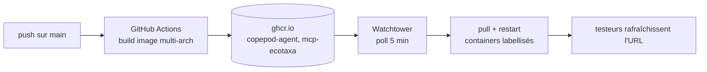
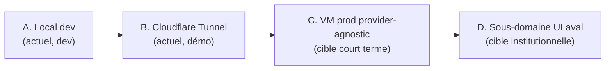

# PARTAGE.md — Partage & déploiement · IDEA

> Comment l'application est partagée **aujourd'hui** et comment elle **devra**
> l'être. Consolide `docs/deploy/DEPLOY.md` (guide prod détaillé) et
> `docs/mcp/MCP_ECOTAXA_SHARE_GUIDE.md` (partage du MCP seul). Ce document donne la
> vision d'ensemble et la trajectoire ; les deux autres restent les runbooks
> pas-à-pas.

---

## 1. Modes de partage — vue d'ensemble

| Mode | Cible | Stabilité | URL | Runbook |
|---|---|---|---|---|
| **A. Local dev** | Développeur seul | — | `http://localhost:3000` | `README.md` |
| **B. Tunnel Cloudflare** | Démo / testeurs, avant VM | éphémère | `*.trycloudflare.com` (change à chaque relance) | `docs/deploy/DEPLOY.md` annexe |
| **C. VM prod provider-agnostic** | Profs + étudiants, 24/7 | stable | `https://$PROD_DOMAIN` | `docs/deploy/DEPLOY.md` §1-11 |
| **D. MCP EcoTaxa seul** | Agent externe / intégrateur | selon hôte | `http://…:8001/mcp` | `docs/mcp/MCP_ECOTAXA_SHARE_GUIDE.md` |

---

## 2. État actuel du partage

### 2.1 Ce qui existe aujourd'hui

Le partage repose sur **Docker Compose + images multi-arch sur GHCR**, avec trois
fichiers compose selon le contexte :

| Fichier | Services | Usage |
|---|---|---|
| `docker-compose.yml` | postgres, copepod-agent, mcp-ecotaxa, open-webui, watchtower | Dev local (`./start.sh`) |
| `docker-compose.prod.yml` | + caddy (TLS auto), watchtower opt-in | VM prod |
| `docker-compose.mcp.yml` | mcp-ecotaxa seul | Partage du MCP isolé |

**Images publiées** sur `ghcr.io/tidianecisse777/` :
`copepod-agent:latest`, `mcp-ecotaxa:latest` — multi-arch `linux/amd64,linux/arm64`
(build par GitHub Actions au push sur `main`).

**Chaîne de mise à jour continue actuelle :**

Seuls `copepod-agent` et `mcp-ecotaxa` sont auto-updatés (label Watchtower).
Postgres et Open WebUI ne le sont **pas** (protection des chats / de la base).

### 2.1.1 Cartes disponibles dès l'installation

Un clone du projet suivi de `pip install -r requirements.txt`, comme l'image
Docker `copepod-agent`, contient les quatre fonds Natural Earth 110m nécessaires
aux cartes IDEA : terre, océan, côtes et frontières nationales. Leur taille
totale est inférieure à 1 Mo. La première carte fonctionne sans téléchargement
Cartopy et sans dépendre d'un cache utilisateur préexistant.

Cela n'embarque pas toutes les données :

- le shapefile IHO source d'environ 142 Mo reste exclu, car le registre compilé
  `data/geo/zones_registry.geojson` suffit à l'exécution ;
- les données EcoTaxa, EcoPart, Amundsen, OGSL et Bio-ORACLE restent interrogées
  uniquement à la demande selon leurs règles de confirmation ;
- seuls les quatre fonds à la résolution effectivement utilisée (`110m`) sont
  versionnés sous `assets/cartopy/`, hors du volume `/app/data` afin qu'une mise
  à jour Docker ne masque jamais les fonds déjà intégrés à l'image.

Les PNG produits sont écrits dans `data/graphs`. En Docker, ce chemin se trouve
dans le volume `copepod_data` et survit donc au remplacement du conteneur.

### 2.2 Partage réel à date

- **Démo / testeurs** : mode B (Cloudflare Tunnel depuis le Mac local). URL
  `*.trycloudflare.com` valable tant que le Mac est allumé et le tunnel actif.
  L'URL change à chaque relance — c'est une limite des quick tunnels anonymes.
- **Pas encore de VM 24/7** dédiée : la cible C est documentée (`docs/deploy/DEPLOY.md`) mais
  pas provisionnée de façon permanente.
- **Partage du MCP seul** (mode D) possible via `docker-compose.mcp.yml` +
  `.env.mcp`, avec accès au package GHCR privé si nécessaire (rôle `Read` GitHub
  + PAT `read:packages`).

### 2.3 Sécurité du partage actuel

| Point | État |
|---|---|
| Open WebUI : premier compte = admin | ⚠️ doit être créé **avant** d'exposer l'URL |
| `ENABLE_SIGNUP=false`, `DEFAULT_USER_ROLE=pending` | ✅ set dans le compose |
| Ports internes bind sur `127.0.0.1` en prod | ✅ (5433/8000/8001 non publics) |
| `MCP_AUTH_TOKEN` Bearer sur le MCP | ✅ généré si absent par `start.sh` |
| `docker.sock` monté dans l'agent | ⚠️ en dev seulement ; `docker-compose.prod.yml` le retire |
| Credentials dans `.env` (chmod 600) | ✅ jamais commité |
| TLS | ✅ auto (Caddy + Let's Encrypt) en mode C ; ⚠️ mode B repose sur Cloudflare |

### 2.4 Limites du partage actuel

- Mode B (Cloudflare) : URL instable, dépend d'un Mac allumé, pas de monitoring, pas un setup prod.
- Pas de VM institutionnelle permanente → pas d'URL stable partageable durablement.
- Pas de quotas multi-utilisateurs production-grade.
- Dépendance à l'API OpenAI (coût + pas de LLM local).

---

## 3. Cible de partage (à venir)

### 3.1 Trajectoire

### 3.2 Cible court terme — VM 24/7 provider-agnostic *(mode C)*

Objectif : remplacer le tunnel éphémère par une **URL stable** sur une VM Linux.

- **Hôtes candidats** : Oracle Cloud Always Free (ARM Ampere A1, gratuit à vie),
  Hetzner `cax11` (~3 €/mois), ou tout VPS x86/ARM (images multi-arch).
- **Provider-agnostic** : `docker-compose.prod.yml` + `Caddyfile` ne contiennent
  aucune référence à un fournisseur. Domaine, email TLS, mots de passe, clés API
  → tous dans `.env`. Migrer d'un hôte à l'autre = recopier `.env` + relancer.
- **TLS auto** via Caddy + Let's Encrypt sur `$PROD_DOMAIN`.
- **Domaine** : DNS dynamique gratuit (DuckDNS) → domaine perso (~10 $/an) → sous-domaine institutionnel.
- **Runbook complet** : `docs/deploy/DEPLOY.md` sections 1 à 11 (hardening, domaine, lancement, bootstrap Open WebUI, mise à jour, backups, monitoring, migration, checklist).

### 3.3 Cible institutionnelle — sous-domaine Université Laval *(mode D)*

Cible préférée pour la **gouvernance et la confiance** :

- Sous-domaine `*.ulaval.ca` ou serveur interne DMS.
- Meilleure confiance des profs qui ouvrent l'URL (domaine institutionnel).
- Demande du temps administratif (admin sys DMS).
- Migration triviale : changer `PROD_DOMAIN` dans `.env`, mettre à jour le DNS. Aucune ligne de compose, de Caddyfile ou de code Python à toucher.

### 3.4 Ce qui doit être renforcé pour la cible

| Chantier | Actuel | Cible |
|---|---|---|
| URL | éphémère (Cloudflare) | stable (`$PROD_DOMAIN` / ULaval) |
| Disponibilité | Mac allumé | VM 24/7 |
| TLS | Cloudflare | Caddy + Let's Encrypt sur domaine propre |
| `docker.sock` | monté (dev) | retiré (prod compose) |
| Backups | — | cron quotidien pg_dump + tar volumes, export B2/S3 |
| Monitoring | — | UptimeRobot sur `/health` + LangSmith |
| Comptes | manuel | admin créé avant exposition, signup off, rôles pending |
| Secrets | `.env` local | `.env` chmod 600 + sauvegarde chiffrée hors VM |

---

## 4. Partage du MCP EcoTaxa seul *(mode D isolé)*

Pour partager **uniquement** le serveur MCP EcoTaxa à un agent externe ou un
intégrateur, sans le reste de la stack IDEA :

1. Fournir `docker-compose.mcp.yml` + `.env.mcp.example`.
2. Le testeur crée `.env.mcp`, renseigne `MCP_AUTH_TOKEN` + credentials EcoTaxa.
3. `docker compose -f docker-compose.mcp.yml up -d`.
4. Connecter l'agent MCP à `http://localhost:8001/mcp` (Bearer `MCP_AUTH_TOKEN`, transport streamable HTTP).
5. Initialiser le cache : `POST /admin/resync`.

Si l'image GHCR est privée : le propriétaire donne un accès `Read` GitHub, le
testeur se connecte à `ghcr.io` avec un PAT `read:packages`.

Runbook complet, catalogue des tools MCP, codes d'erreur et tests de fumée :
**`docs/mcp/MCP_ECOTAXA_SHARE_GUIDE.md`**.

---

## 5. Checklist de mise en partage (résumé)

**Avant d'exposer une URL (tout mode public) :**
- [ ] Compte admin Open WebUI créé avec ton email
- [ ] `Enable New User Sign Ups` → OFF, `Default User Role` → Pending
- [ ] Un compte par testeur, ou approbation manuelle des comptes pending

**Cible VM prod (en plus) :**
- [ ] `https://$PROD_DOMAIN` répond en HTTPS valide
- [ ] Ports 5433 / 8000 / 8001 non joignables de l'extérieur
- [ ] `docker-compose.prod.yml` (sans `docker.sock`) utilisé
- [ ] Backup cron créé et premier run validé
- [ ] UptimeRobot configuré sur `/health`
- [ ] `.env` sauvegardé chiffré hors VM

Détail exhaustif : `docs/deploy/DEPLOY.md` §11.

---

## 6. Migration entre hôtes

Tout ce qui caractérise une instance est dans `.env` + les volumes Docker.
Migrer = arrêter le compose, dump Postgres, tar les volumes, recopier sur le
nouvel hôte, restaurer, mettre à jour le DNS, relancer. Caddy refait un
certificat sur le même domaine, transparent côté testeurs. **Aucun code à
toucher.** Voir `docs/deploy/DEPLOY.md` §10.
