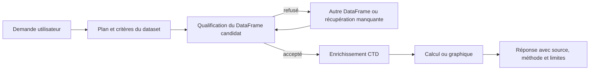

# Présentation de l’agent IDEA

IDEA est l’assistant d’exploration de données marines du NeoLab de
l’Université Laval. Il aide à transformer des fichiers et des sources métier
hétérogènes en tables vérifiables, calculs, graphiques et livrables traçables.

Il s’adresse principalement aux professeurs et aux étudiants travaillant sur
les copépodes et les données océanographiques associées. Il décrit les données
et les traitements; il ne remplace pas l’interprétation scientifique.

## Ce que l’agent sait faire

| Besoin | Capacités |
|---|---|
| Comprendre les données | charger un fichier, inventorier les DataFrames, décrire leur grain, leurs colonnes et leur provenance |
| Explorer et calculer | filtrer, joindre, agréger et contrôler les données avec pandas |
| Visualiser | produire des graphiques et des cartes à partir d’un DataFrame qualifié |
| Interroger EcoTaxa | rechercher dans le cache, exporter des samples et réutiliser les résultats en SQL ou pandas |
| Enrichir | ajouter des données EcoPart, Amundsen CTD, Bio-ORACLE ou OGSL |
| Situer géographiquement | identifier une zone ou filtrer et découper un DataFrame par zones |
| Documenter | consulter le RAG métier et résoudre des noms taxonomiques marins |
| Livrer | générer des résultats téléchargeables et des rapports |

## Exemple de parcours

Pour demander une carte des profils de la baie de Baffin enrichie avec des
mesures CTD, l’agent suit une chaîne contrôlée :

La qualification vérifie le grain, les colonnes requises, la portée, les clés,
les doublons et les valeurs manquantes. L’agent peut donc abandonner un candidat
inadapté et en choisir un autre avant le calcul final.

## Pourquoi l’inventaire des DataFrames est central

Une conversation peut contenir des fichiers chargés, des exports EcoTaxa, des
résultats SQL et plusieurs enrichissements. IDEA présente ces ressources avec :

- un nom stable et explicite;
- une description adaptée à la demande courante;
- leur grain et leurs dimensions;
- les colonnes pertinentes, classées par type;
- leur origine, leurs parents, filtres, jointures et calculs connus;
- leur ancienneté et leur rôle dans la lignée des résultats visibles.

Les fichiers importés et les résultats durables comme les exports ou les
enrichissements restent prioritaires. Les DataFrames dérivés temporaires sont
progressivement résumés puis retirés du contexte afin de ne pas noyer le modèle.

## Fonctionnement conversationnel

À chaque tour, le modèle reçoit un contexte transitoire structuré autour de la
tâche courante, des DataFrames disponibles, du dernier graphique et de la
frontière d’exploration. Le checkpoint LangGraph conserve la progression utile
entre les tours.

Le catalogue comprend 22 tools obligatoires et 25 lorsque le workspace SQL
optionnel est configuré. Avec Tool Search, les fonctions fréquentes restent
immédiatement visibles et les familles EcoTaxa, EcoPart, géographie et
enrichissements sont chargées à la demande. Un fallback conserve toujours le
catalogue canonique complet si Tool Search est indisponible.

Le choix d’une source est une préférence contextuelle, jamais une interdiction.
L’agent peut combiner plusieurs familles lorsque la demande le nécessite.

## Garanties de comportement

- Aucun chiffre n’est inventé : il provient d’un tool, d’un calcul ou du RAG.
- Les données brutes ne sont pas modifiées en place.
- Les opérations coûteuses ou volumineuses demandent une confirmation ciblée.
- Les réponses indiquent la source, la méthode, les limites et l’action suivante.
- Le RAG est utilisé pour les définitions, protocoles et contrats de données;
  lorsqu’il est appelé, l’agent attend son résultat avant de poursuivre.
- Les credentials ne sont jamais exposés dans les réponses ou les logs.
- OBIS n’est pas une source autorisée.
- Les réponses sont en français par défaut.

## Limites

La qualité du résultat dépend des colonnes, identifiants et métadonnées réellement
disponibles. IDEA peut signaler un manque, récupérer une ressource accessible ou
proposer une autre méthode, mais ne complète pas une valeur scientifique absente
par supposition. L’interprétation biologique finale reste sous la responsabilité
de l’utilisateur.

## Documentation associée

- [README.md](README.md) — installation et démarrage rapide
- [ARCHITECTURE.md](ARCHITECTURE.md) — architecture technique simplifiée
- [TOOLS.md](TOOLS.md) — catalogue canonique des tools
- [BEST_PRACTICES.md](BEST_PRACTICES.md) — usage et développement
