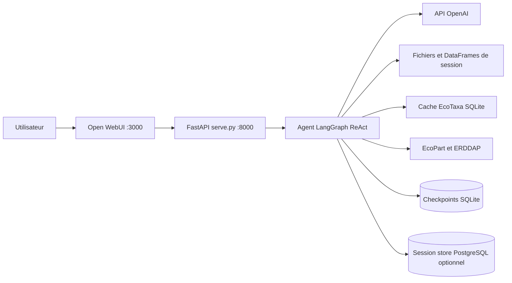

# IDEA — Assistant de données marines NeoLab

IDEA est un assistant LangGraph spécialisé dans l’exploration, l’analyse et la
visualisation de données biologiques et océanographiques. Il est destiné aux
chercheurs, professeurs et étudiants de NeoLab à l’Université Laval.

L’agent peut charger des fichiers tabulaires, choisir et qualifier le bon
DataFrame, calculer avec pandas, produire des graphiques scientifiques, explorer
le cache EcoTaxa et enrichir des données avec EcoPart, Amundsen CTD,
Bio-ORACLE ou OGSL. Il répond en français par défaut.

## Ce qui caractérise l’agent

- Un seul agent ReAct, sans mode de session.
- Un état d’exploration persistant : objectif, plan, dépendances et preuves.
- Un inventaire explicite des DataFrames avec source, description, grain,
  colonnes, clés, filtres et lignée.
- Une qualification du DataFrame candidat avant un calcul ou un graphique.
- Un RAG métier utilisé pour les définitions, protocoles et méthodes; lorsqu’il
  est appelé, l’agent attend sa réponse avant de poursuivre.
- Un catalogue réduit à 22 tools obligatoires, 25 lorsque le workspace SQL est
  configuré.
- OpenAI Tool Search pour différer les schémas spécialisés sans cacher leurs
  capacités; les providers sans Tool Search reçoivent tout le catalogue canonique.
- Des résultats structurés et traçables, sans valeur scientifique inventée.

- [PRESENTATION.md](PRESENTATION.md) — présentation fonctionnelle
- [ARCHITECTURE.md](ARCHITECTURE.md) — architecture simplifiée
- [TOOLS.md](TOOLS.md) — catalogue des tools
- [BEST_PRACTICES.md](BEST_PRACTICES.md) — bonnes pratiques

## Architecture en bref



Le code du dépôt est monté dans le conteneur agent. Uvicorn tourne sans
`--reload` afin de ne pas couper les réponses SSE actives; après un changement,
redémarrer explicitement le service `copepod-agent` (sans rebuild).

## Capacités principales

| Domaine | Capacités |
|---|---|
| Fichiers | CSV, TSV, Excel, JSON, Parquet; inspection et persistance |
| Analyse | qualification, filtres, agrégations, jointures contrôlées, contrôles qualité |
| Graphiques | matplotlib et Cartopy, PNG persistants, cartes hors ligne |
| EcoTaxa | inspection du cache, SQL read-only, sélections persistées, exports confirmés |
| EcoPart | correspondance, aperçu et enrichissement distant |
| Environnement | Amundsen CTD, Bio-ORACLE et OGSL |
| Géographie | zones IHO/MEOW, filtre ou découpage multi-zone |
| Savoir | RAG NeoLab et résolution taxonomique WoRMS/Wikipedia |
| SQL optionnel | introspection, aperçu et copie d’un `SELECT` borné |
| Livrable | génération PDF/HTML traçable |

## Démarrage rapide

Prérequis : Docker Desktop avec Compose et une clé API OpenAI.

```bash
git clone https://github.com/TidianeCisse777/IDEA.git
cd IDEA
cp .env.example .env
```

Configurer au minimum :

```dotenv
OPENAI_API_KEY=...
LLM_MODEL=gpt-5.6-luna
```

Pour utiliser OpenAI Tool Search avec un modèle compatible et l’endpoint
OpenAI direct :

```dotenv
OPENAI_TOOL_SEARCH_ENABLED=true
OPENAI_BASE_URL=
```

Si la release du cache EcoTaxa est privée :

```dotenv
ECOTAXA_CACHE_RELEASE_TOKEN=...
```

Démarrer la stack :

```bash
./start.sh
```

Services :

| Service | URL |
|---|---|
| Open WebUI | <http://localhost:3000> |
| Agent FastAPI | <http://localhost:8000> |
| MCP EcoTaxa | <http://localhost:8001> |
| PostgreSQL | `localhost:5433` |

Le mode `consumer`, activé par défaut, télécharge un cache EcoTaxa validé sans
demander les identifiants EcoTaxa de chaque collaborateur. Le mode `publisher`
est réservé au mainteneur du cache.

## Workspace SQL optionnel

Configurer une URL SQLAlchemy read-only dans `.env` :

```dotenv
DATABASE_URL=sqlite:////app/data/sql_workspace_demo/ocean_observations.sqlite
```

SQLite, PostgreSQL, MySQL et MariaDB sont pris en charge. Sans `DATABASE_URL`,
les trois tools SQL ne sont pas ajoutés au catalogue.

## Vérification

```bash
docker compose ps
curl -fsS http://localhost:8000/v1/models
curl -fsS http://localhost:8001/health
```

Contrats ciblés du catalogue et du contexte, sans appel LLM :

```bash
pytest -q \
  tests/test_tool_catalog.py \
  tests/test_tool_policy_registry.py \
  tests/test_openai_tool_search.py \
  tests/test_tool_exposure.py

python scripts/dev/run_context_projection_campaign.py --json
```

Le harness de projection simule l’évolution du contexte sur plusieurs tours,
sans réseau et sans crédit modèle.

Pour inspecter les tours réels d’une conversation en cours :

```bash
curl -s "http://localhost:8000/debug/harness-turns?thread_id=THREAD_ID&limit=20" | jq
curl -s "http://localhost:8000/debug/harness-turns?thread_id=THREAD_ID&turn_index=3" | jq
```

Chaque tour montre le contexte transmis au modèle (`CURRENT TASK`, DataFrames,
frontier et dernier graphique), les tools visibles, les décisions du modèle,
les appels de tools, leurs résultats bornés, la durée et les tokens. La trace
complète du tour est également écrite dans `logs/conversations/THREAD_ID.jsonl`.
Voir [`MONITORING.md`](MONITORING.md) pour la navigation locale pas à pas.

## Configuration utile

| Variable | Rôle | Défaut |
|---|---|---|
| `OPENAI_API_KEY` | Provider LLM | requis |
| `LLM_MODEL` | Modèle | `gpt-5.6-luna` |
| `OPENAI_TOOL_SEARCH_ENABLED` | Tool Search OpenAI | `false` |
| `LLM_MAX_OUTPUT_TOKENS` | Plafond de sortie | `16000` |
| `MAX_CONTEXT_TOKENS` | Budget du contexte modèle | `100000` |
| `MAX_CHECKPOINT_MESSAGES` | Messages structurés conservés dans le checkpoint LangGraph | `40` |
| `MAX_LIVE_DERIVED_DATAFRAMES` | DataFrames dérivés simultanément visibles; les sources sont exclues | `20` |
| `MAX_TOOL_RESULT_CHARS` | Troncature d’un résultat de tool | `8000` |
| `HARNESS_TRACE_MAX_TURNS` | Tours de monitoring gardés en mémoire par conversation | `50` |
| `CHECKPOINTS_DB` | Checkpoints LangGraph | `data/checkpoints.sqlite` |
| `SESSION_STORE_DATABASE_URL` | Métadonnées/DataFrames persistants | fichiers locaux si absent |
| `DATABASE_URL` | Workspace SQL read-only | optionnel |
| `OPENWEBUI_URL` | Backend Open WebUI | `http://open-webui:8080` |

Les credentials restent dans `.env`, qui ne doit jamais être commité ni affiché.

## Arrêt

```bash
docker compose stop open-webui copepod-agent mcp-ecotaxa postgres
```

## Documentation complémentaire

- [SPEC.md](SPEC.md) — spécification fonctionnelle historique détaillée.
- [SEQUENCES.md](SEQUENCES.md) — diagrammes de séquence détaillés.
- [PARTAGE.md](PARTAGE.md) — partage et déploiement.
- [CONTEXT.md](CONTEXT.md) — identité métier et périmètre.
