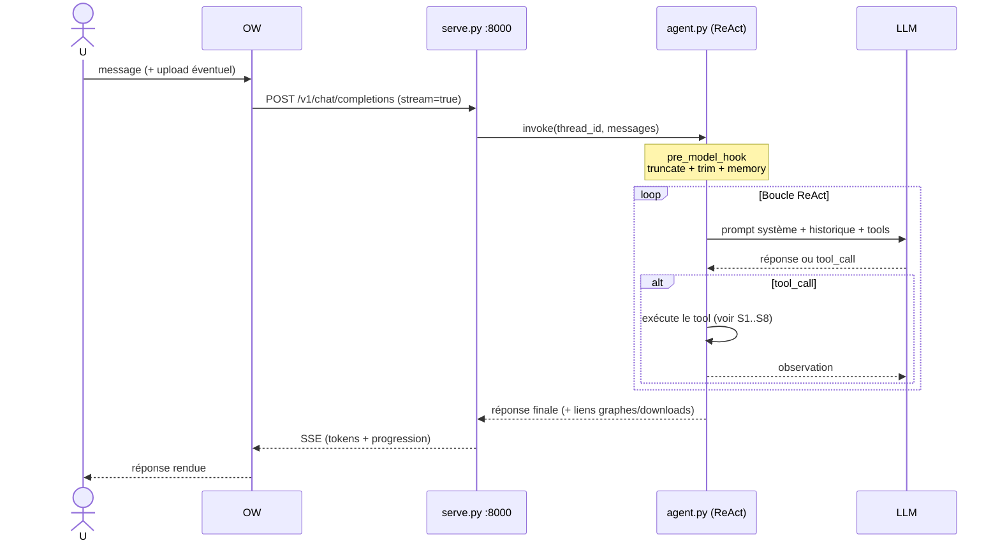
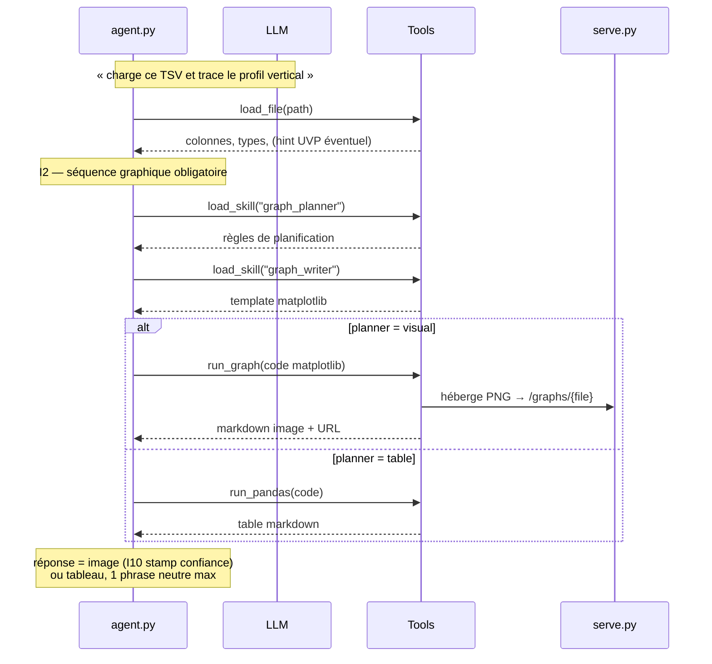
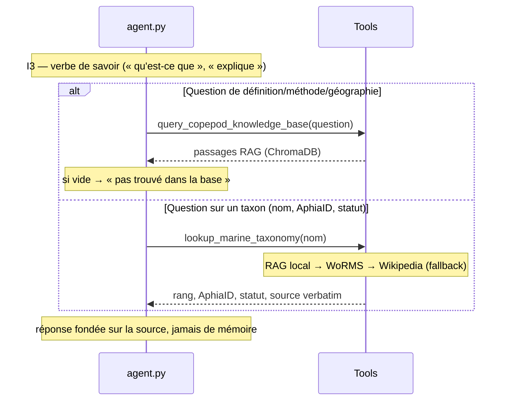
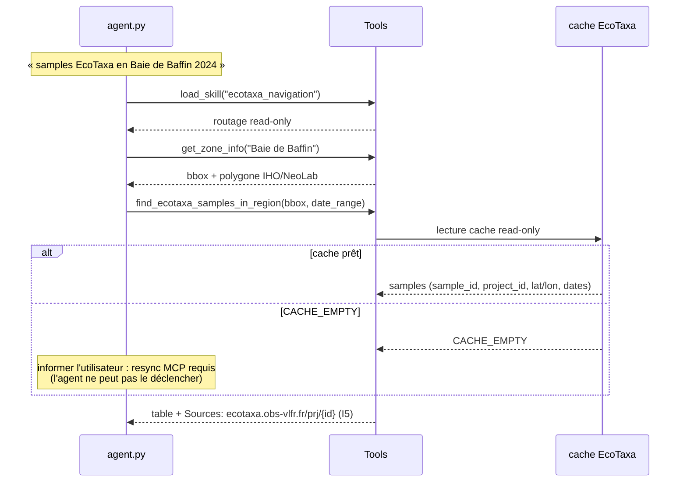
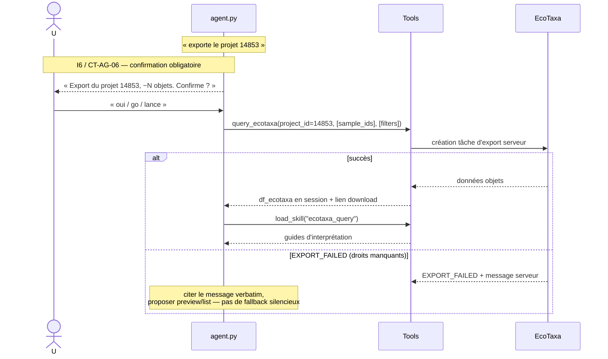
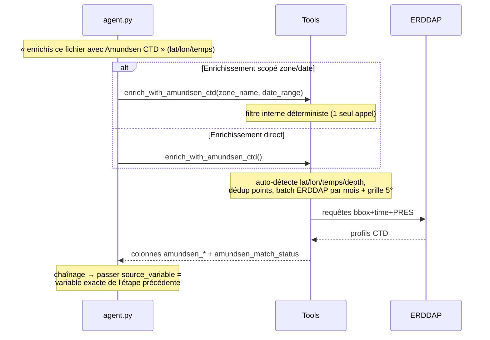
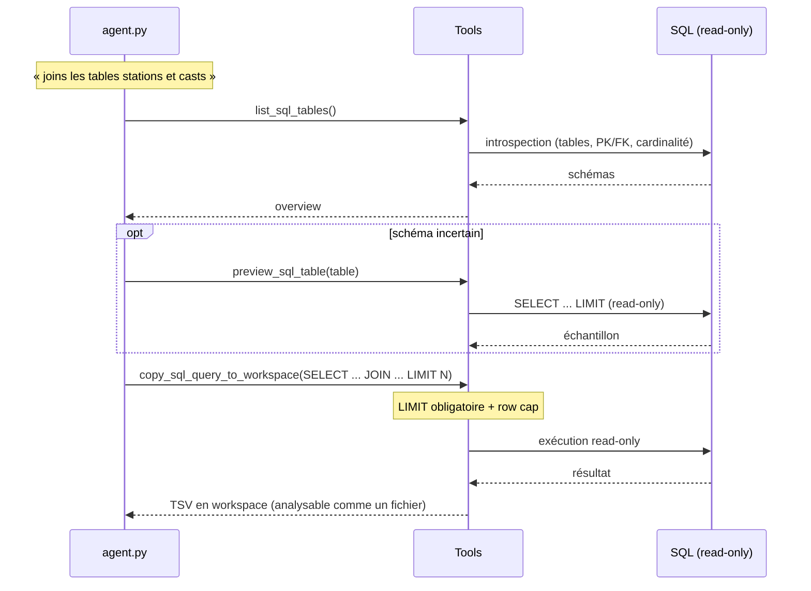
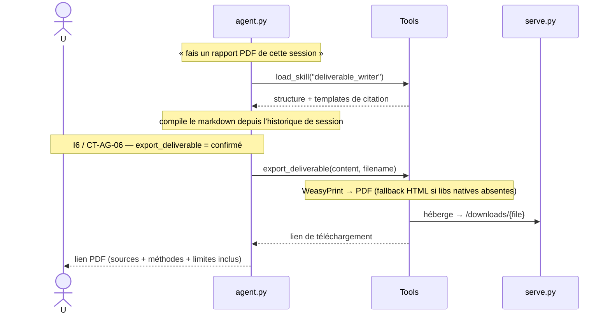
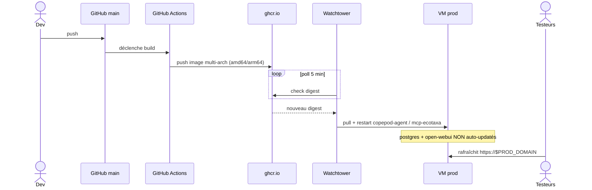

# SEQUENCES.md — Diagrammes de séquence · IDEA

> Flux détaillés d'un message utilisateur jusqu'au résultat, par use case.
> Contexte : [`ARCHITECTURE.md`](ARCHITECTURE.md) (composants), [`SPEC.md`](SPEC.md)
> (use cases UC-*), [`PARTAGE.md`](PARTAGE.md) (déploiement).

Acteurs communs :
- **U** : Utilisateur (Open WebUI)
- **OW** : Open WebUI (:3000)
- **API** : `serve.py` FastAPI (:8000)
- **AG** : `agent.py` LangGraph ReAct
- **LLM** : API LLM
- **T** : Tools Python
- **MCP** : cache EcoTaxa
- **EXT** : sources externes (EcoTaxa/EcoPart/ERDDAP)

---

## S0 · Flux transport générique (tout message)



Toutes les séquences suivantes se déroulent **à l'intérieur de la boucle ReAct**
de S0. Seuls les appels de tools spécifiques sont montrés.

---

## S1 · UC-A/B · Charger un fichier et tracer un graphique



---

## S2 · UC-C · Question de savoir (RAG) et taxonomie



---

## S3 · UC-D · Exploration EcoTaxa par zone + période (read-only)



---

## S4 · UC-E · Export EcoTaxa (opération confirmée)



---

## S5 · UC-F · Join EcoTaxa ↔ EcoPart

```mermaid
sequenceDiagram
    actor U
    participant AG as agent.py
    participant T as Tools
    participant EXT as EcoPart

    alt Workflow 1 — les deux df en session
        Note over AG: df_ecotaxa ET df_ecopart chargés
        AG->>T: join_ecotaxa_ecopart()
        Note over T: join (sample_id, depth_bin 5m)<br/>préfixe ecopart_*, stocke df_ecotaxa_ecopart
        T-->>AG: table jointe + couverture de match
    else Workflow 2/3 — EcoPart absent (fetch distant, confirmé)
        AG-->>U: « Enrichir EcoTaxa avec EcoPart ? » (CT-AG-06)
        U->>AG: « oui »
        AG->>T: enrich_ecotaxa_with_ecopart_remote()
        T->>EXT: recherche bbox + export EcoPart
        EXT-->>T: profils EcoPart
        T-->>AG: table enrichie + df_ecotaxa_ecopart
    end
    Note over AG: I — REQUIS : reporter la couverture de match ;<br/>avertir si 0/faible (campagne ≠ ou hors plage de profondeur)
```

---

## S6 · UC-G · Enrichissement environnemental (Amundsen / OGSL / Bio-ORACLE)



Même patron pour `enrich_with_ogsl` (OGSL ISMER) et `enrich_with_bio_oracle`
(variables actuelles + scénarios SSP ; > 10 lignes multi-var → confirmation).

---

## S7 · UC-H · Workspace SQL read-only



---

## S8 · UC-J · Livrable PDF



---

## S9 · Cycle de mise à jour continue (déploiement)


