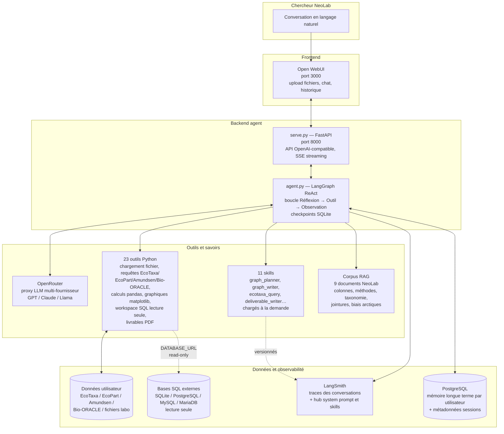
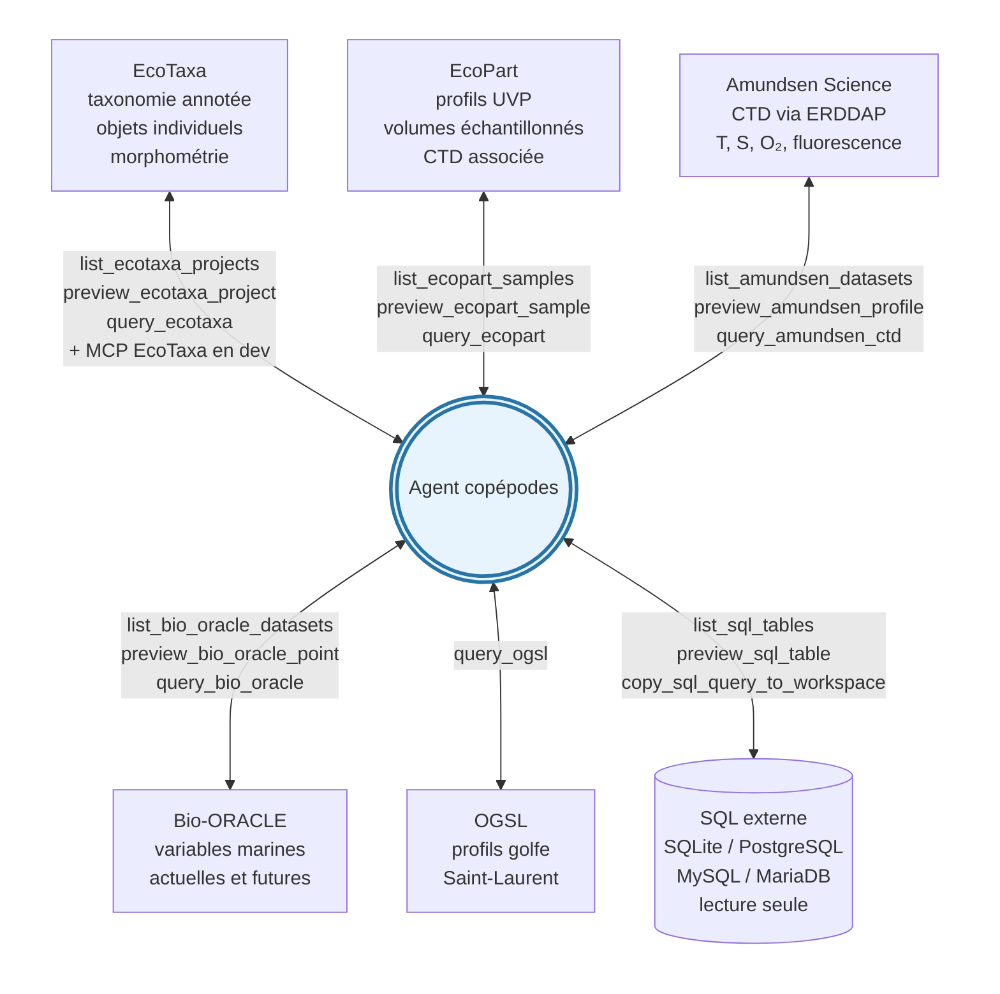
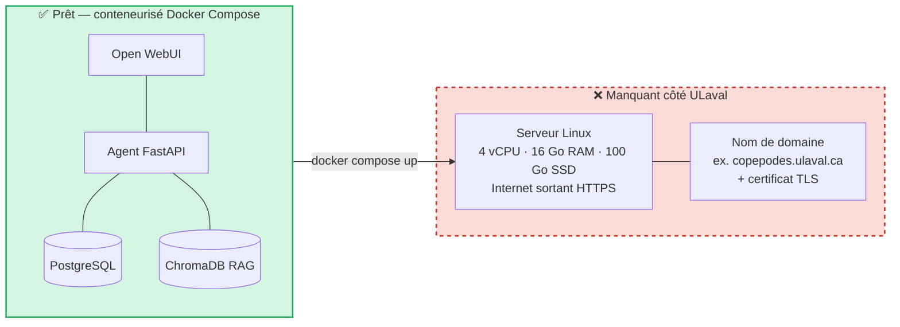

# Assistant graphique copépodes — Brief d'avancement

| | |
|---|---|
| **Auteur** | Tidiane Cissé |
| **Public** | Superviseurs NeoLab |
| **Date** | 2026-06-12 |
| **Statut** | V1 fonctionnelle en local |

---

## 1. Architecture

---

## 2. Sources de données accessibles en ligne

---

## 3. Ce que l'agent sait faire, partiellement faire, ou ne fait pas

| Capacité | Statut | Détail |
|---|---|---|
| **Charger** un fichier local | ✅ fait | CSV, TSV, Excel, JSON, Parquet, exports UVP, fichiers labo — détection auto du format |
| **Analyser** une table chargée | ✅ fait | Inspection des colonnes, types, plages de valeurs, distributions |
| **Auditer** une table chargée | ✅ fait | Détection des valeurs manquantes, doublons, incohérences, lacunes temporelles ou spatiales |
| **Calculer** sur les données | ✅ fait | Filtrage, agrégations, jointures, variables dérivées via `run_pandas` sandboxé |
| **Calculer des métriques d'abondance** | ✅ fait | Densités (ind/m³), biomasses, indices par taxon, par station, par strate de profondeur — normalisation par volume échantillonné UVP |
| **Produire des graphiques** variés | ✅ fait | Distribution verticale, spatio-temporel, taxonomie, profils CTD, variables dérivées — palette d'incertitude appliquée |
| **Cartes géographiques** | ✅ fait | Stations échantillonnées, abondances spatiales, cartes de lacunes — projections adaptées aux hautes latitudes |
| **Connaissance des lieux et mers arctiques** | ✅ fait | Toponymie de la mer de Beaufort, baie de Baffin, détroits canadiens, mer du Labrador, golfe du Saint-Laurent ; biais arctiques documentés dans le RAG NeoLab |
| **Lister les projets EcoTaxa** disponibles | ✅ fait | `list_ecotaxa_projects` puis preview et export ciblé d'un projet donné |
| **Lister les échantillons EcoPart** disponibles | ✅ fait | `list_ecopart_samples` puis preview et export d'un échantillon UVP donné |
| **Récupérer les données Bio-ORACLE** selon scénario | ✅ fait | Variables marines actuelles **et futures** (scénarios climatiques SSP), sélection par zone et profondeur |
| **Récupérer les données OGSL** à des endroits précis | ✅ fait | Profils CTD du golfe du Saint-Laurent, recherche par station / fenêtre temporelle / profondeur, enrichissement d'une table existante |
| **Récupérer les CTD Amundsen Science** | ✅ fait | Accès ERDDAP : température, salinité, O₂, fluorescence par campagne et station |
| **Jointures biologique ↔ environnemental** | ✅ fait | `join_ecotaxa_ecopart`, `couple_zooplankton_bio_oracle` |
| **Brancher une base SQL externe** (lecture seule) | ✅ fait | SQLite, PostgreSQL, MySQL, MariaDB — découverte tables/PK/FK, preview filtré, copie TSV |
| **Livrables PDF** avec citations vérifiées | ✅ fait | `export_deliverable` via WeasyPrint |
| **Rapport de synthèse de la session** | ✅ fait | Récapitulatif des données chargées, calculs effectués, graphiques produits et sources mobilisées, exportable en PDF |
| **Recherche dans le corpus métier** (9 documents NeoLab) | ✅ fait | `query_copepod_knowledge_base` (ChromaDB) |
| **Mémoire courte terme** (reprise après redémarrage) | ✅ fait | Checkpoints SQLite par conversation |
| **Mémoire longue terme** entre conversations | ✅ fait | LangMem + PostgreSQL, isolée par utilisateur |
| Gestion entière du contexte conversationnel | 🟡 partiel | Mémoire courte + longue terme en place, mais pas de gestion fine du contexte sur les sessions très longues (compression, résumé automatique, oubli sélectif) |
| Validation bout-en-bout des use cases | 🟡 partiel | Les 23 tools sont implémentés et chacun a été testé individuellement (42 tests unitaires verts), mais plusieurs use cases complets (de la question initiale au livrable final) n'ont pas encore été éprouvés en profondeur |
| Graphiques interactifs (HTML/Plotly) | 🟡 partiel | Sortie PNG uniquement aujourd'hui — reporté V2 |
| Exploration libre du catalogue EcoTaxa depuis l'agent | ❌ pas fait | L'agent interroge un projet une fois son ID connu, mais ne propose pas encore de parcours interactif du catalogue (filtrage par campagne, région, taxon, période) |
| Génération de code en R | ❌ pas fait | Python/matplotlib uniquement — reporté V2 |
| Multi-utilisateurs (sessions isolées, authentification, quotas par chercheur) | ❌ pas fait | Aujourd'hui un seul chercheur à la fois sur la machine de dev |
| Déploiement sur serveur ULaval | ❌ pas fait | Prochaine étape — voir besoins IT |
| Indépendance vis-à-vis de l'API OpenAI | ❌ pas fait | L'agent dépend encore d'OpenAI via OpenRouter ; pas de modèle hébergé en local — bascule envisageable après les tests utilisateurs |

---

## 4. Déploiement

