# IDEA — Project Component Reference

> **What this file is:** A full breakdown of every folder, file, and component in the IDEA codebase — what each one does, which files it directly uses, and which files use it. Generated by inspecting all source files.

```mermaid
graph TB
    Browser["🌐 Browser"]

    subgraph Docker["Docker Compose Stack"]
        Nginx["nginx:alpine\n:80 (reverse proxy)"]

        subgraph Frontend["frontend container\npython:3.11-alpine :8000"]
            FE["Static Files\nHTML / CSS / JS\n(assistant.js, conversation_manager.js, etc.)"]
        end

        subgraph Web["web container (FastAPI)\nuvicorn :8001"]
            APP["app.py\nFastAPI entrypoint\n+ middleware + routers"]

            subgraph Routes["routes/"]
                R_AUTH["auth.py\n/login /logout /guest-login"]
                R_USERS["users.py\n/users /users/me"]
                R_CHAT["chat.py\n/chat /history /clear /transcribe"]
                R_FILES["files.py\n/upload /files /share"]
                R_CONV["conversations.py\n/conversations"]
                R_KB["knowledge_base.py\n/knowledge-base"]
                R_MCP["mcp.py\n/mcp"]
                R_PROMPTS["prompts.py\n/prompts"]
            end

            subgraph Backend["backend/"]
                INTERP_MGR["interpreter_manager.py\nOpenInterpreter lifecycle"]
                STATE["state.py\nShared state & constants"]
                AUTH["auth.py\nJWT session management"]
                MCP_H["mcp_helpers.py\nMCP tool planning & execution"]
                GUEST["guest_manager.py\nGuest user expiry"]
            end

            subgraph Core["core/"]
                CONFIG["config.py\nPydantic settings"]
                DB_CORE["db.py\nSQLModel session factory"]
                MCP_MGR["mcp_manager.py\nMCP connection manager"]
            end

            subgraph Utils["utils/"]
                SYS_PROMPT["prompts/system_prompt.py"]
                CUSTOM_INST["prompts/custom_instructions.py"]
                TOOLS["tools/custom_functions.py\n(pre-loaded into interpreter)"]
                PQA["pqa/pqa_multi_tenant.py\nPaperQA2 RAG"]
                PROMPT_MGR["prompt_manager.py"]
            end

            subgraph InterpreterInstances["In-Memory: interpreter_instances{}"]
                SESS1["OpenInterpreter\nuser_id:session_id"]
                SESS2["OpenInterpreter\nuser_id:session_id"]
            end
        end

        Redis["redis:alpine\n:6379\nmessages:{key}\nlast_active:{key}\nguest expiry ZSET"]

        subgraph DB["db container\npgvector/pgvector:pg17\n:5432"]
            USERS_T["users table"]
            CONV_T["conversations table"]
            PROMPTS_T["prompts table"]
            MSGS_T["messages table"]
        end

        Static["/static/\nuser_id/session_id/\n(plots, outputs)"]
    end

    LLM["☁️ OpenAI API\n(gpt-5.5 via litellm)"]
    MCP_EXT["☁️ External MCP Servers"]

    Browser -->|"HTTP :80"| Nginx
    Nginx -->|"/ → frontend"| FE
    Nginx -->|"/api/ /idea-api/ → web:8001"| APP
    Nginx -->|"/static/ → web:8001/idea-api/static/"| Static

    APP --> Routes
    Routes --> Backend
    Backend --> Core
    Backend --> Utils

    R_CHAT -->|"get_or_create_interpreter()"| INTERP_MGR
    INTERP_MGR -->|"stores/retrieves"| InterpreterInstances
    INTERP_MGR -->|"sys_prompt + active_prompt"| SYS_PROMPT
    INTERP_MGR -->|"custom_tool pre-load"| TOOLS

    R_CHAT -->|"SSE stream"| Browser
    InterpreterInstances -->|"LLM calls"| LLM
    InterpreterInstances -->|"executes Python\nsaves plots"| Static

    R_CHAT -->|"read/write messages"| Redis
    R_CHAT -->|"plan_and_run_mcp_tools()"| MCP_H
    MCP_H -->|"tool calls"| MCP_EXT
    MCP_MGR -->|"manages connections"| MCP_EXT

    AUTH --> Redis
    GUEST -->|"expiry tracking"| Redis

    Backend -->|"SQLModel queries"| DB_CORE
    DB_CORE --> DB

    R_KB -->|"per-user index"| PQA

    classDef container fill:#1e3a5f,stroke:#4a9eff,color:#fff
    classDef service fill:#2d4a2d,stroke:#6abf6a,color:#fff
    classDef external fill:#4a2d00,stroke:#ffaa44,color:#fff
    classDef storage fill:#3a1a4a,stroke:#c084fc,color:#fff

    class Web,Frontend container
    class Nginx,Redis service
    class LLM,MCP_EXT external
    class DB,Static storage
```

## Table of Contents

1. [Entry Points & Startup](#1-entry-points--startup)
2. [Docker / Infrastructure](#2-docker--infrastructure)
3. [Routing Layer — `routes/`](#3-routing-layer--routes)
4. [Business Logic Layer — `backend/`](#4-business-logic-layer--backend)
5. [Infrastructure Core — `core/`](#5-infrastructure-core--core)
6. [Utilities — `utils/`](#6-utilities--utils)
7. [Frontend — `frontend/`](#7-frontend--frontend)
8. [Database Migrations — `alembic/`](#8-database-migrations--alembic)
9. [Skills — `skills/`](#9-skills--skills)
10. [Static Output Directory — `static/`](#10-static-output-directory--static)
11. [File Ingestion & Status Summary](#11-file-ingestion--status-summary)

---

## 1. Entry Points & Startup

### `app.py`
**What it does:** The FastAPI application entry point. Creates the `app` instance, registers all routers, mounts static directories, configures CORS, rate limiting, request size limits, and launches two recurring background tasks on startup.

**Background tasks started here:**
- `periodic_cleanup()` — runs `cleanup_idle_sessions()` every 30 minutes (1800s)
- `periodic_guest_cleanup()` — runs `cleanup_expired_guest_users()` every 60 seconds

**Files it uses:**
- `backend/guest_manager.py` — `cleanup_expired_guest_users`
- `backend/interpreter_manager.py` — `cleanup_idle_sessions`
- `backend/state.py` — `STATIC_DIR`, `limiter`, constants
- `core/mcp_manager.py` — `mcp_manager.close_all()` on shutdown
- `routes/auth.py`, `routes/users.py`, `routes/prompts.py`, `routes/chat.py`, `routes/files.py`, `routes/knowledge_base.py`, `routes/conversations.py`, `routes/mcp.py`
- `utils/prompt_manager.py` — `init_prompt_manager()`

**Used by:** Nothing — this is the top-level entry point. Launched by `uvicorn app:app`.

---

### `local_start.sh`
**What it does:** Development startup script. Runs `docker compose -f docker-compose.yml -f docker-compose.override.yml up --build`. Enables live reload, mounts the project directory into the container, and adds the `frontend` static server + `nginx` services.

### `production_start.sh`
**What it does:** Production startup. Runs `docker compose -f docker-compose.yml up --build`. No live reload, no host filesystem mounts beyond `data/` and `.codex/`.

### `entrypoint.sh` / `prestart.sh` / `backend_prestart.py`
**What they do:** Container startup sequence. Runs Alembic migrations and seeds the initial superuser before uvicorn starts.

### `initial_data.py`
**What it does:** Seeds the database with the first superuser account using credentials from `.env` (`FIRST_SUPERUSER`, `FIRST_SUPERUSER_PASSWORD`). Called by `backend_prestart.py`.

---

## 2. Docker / Infrastructure

### `docker-compose.yml` — Production stack
| Service | Image | Internal Port | External Port | Role |
|---|---|---|---|---|
| `web` | Custom (`Dockerfile`) | 8001 | 8002 | FastAPI backend (uvicorn) |
| `db` | `pgvector/pgvector:pg17` | 5432 | — | PostgreSQL + pgvector extension |
| `redis` | `redis:alpine` | 6379 | 6380 | Session cache, message history |

### `docker-compose.override.yml` — Local development additions
Adds to and overrides the production stack for local dev:
| Service | Image | Internal Port | External Port | Role |
|---|---|---|---|---|
| `web` | Same | 8001 | via nginx | Live-reload uvicorn (`--reload`) |
| `frontend` | `python:3.11-alpine` | 8000 | 8000 | `python -m http.server` for static files |
| `nginx` | `nginx:alpine` | 80 | 80 | Reverse proxy for everything |
| `db` | Same | 5432 | **5432** | Exposed locally for direct access |
| `redis` | Same | 6379 | **6379** | Exposed locally |

### `nginx.conf`
**What it does:** Nginx routing rules. All traffic enters on port 80.

| URL Pattern | Proxied To | Notes |
|---|---|---|
| `/` | `frontend:8000` | All static pages |
| `/api/` | `web:8001/` | Backend API shorthand |
| `/idea-api/` | `web:8001/idea-api/` | FastAPI root_path prefix |
| `/conversations/` | `web:8001/conversations/` | Conversation CRUD |
| `/static/` | `web:8001/idea-api/static/` | Generated outputs (plots, files) |
| `/share/` | `web:8001/share/` | Public conversation share links |

SSE/streaming is enabled via `proxy_buffering off` and `chunked_transfer_encoding off` on API routes. Timeouts are 300 seconds for long-running analysis requests.

### `Dockerfile`
**What it does:** Builds the `web` container. Installs Python dependencies from `requirements.txt`, copies the full project, and sets uvicorn as the default command.

### `.env` / `.env.example`
**What it does:** Single source of all secrets and configuration. Never committed. Required variables:
- `OPENAI_API_KEY` — LLM access via litellm
- `POSTGRES_DB`, `POSTGRES_USER`, `POSTGRES_PASSWORD`, `POSTGRES_SERVER`, `POSTGRES_PORT`
- `SECRET_KEY` — JWT signing secret
- `FIRST_SUPERUSER`, `FIRST_SUPERUSER_PASSWORD`
- `CORS_ORIGINS` (optional) — comma-separated allowed origins
- `GUEST_SESSION_TIMEOUT_MINUTES` (optional, default 60)
- `GUEST_EXPIRY_CHECK_INTERVAL_SECONDS` (optional, default 60)

---

## 3. Routing Layer — `routes/`

> These files contain **only HTTP routing**. All business logic lives in `backend/`.

---

### `routes/auth.py`
**Endpoints:** `POST /login`, `POST /logout`, `GET /auth/verify`, `POST /guest-login`

**What it does:** Handles user authentication. On login, verifies credentials against the database, generates a JWT token, stores it in `auth_sessions` dict (in-memory), and returns it to the client. Guest login creates a temporary account via `guest_manager`.

**Files it uses:**
- `backend/auth.py` — `verify_password`, `generate_auth_token`, `add_auth_session`, `remove_auth_session`
- `backend/guest_manager.py` — `create_guest_user`
- `backend/models.py` — `LoginRequest`, `LoginResponse`
- `core/db.py` — database session

---

### `routes/users.py`
**Endpoints:** `GET /users`, `POST /users`, `GET /users/me`, `PATCH /users/me`, `DELETE /users/{id}`, `POST /users/change-password`

**What it does:** Full user CRUD for superusers. `/users/me` returns the authenticated user's own profile. Password change endpoint verifies the current password before updating.

**Files it uses:**
- `backend/auth.py` — `get_auth_token`, `get_current_user`
- `backend/auth_helpers.py` — `_ensure_superuser`
- `backend/crud.py` — all user DB operations
- `backend/models.py` — `User`, `UserCreate`, `UserUpdate`, `UserPublic`
- `core/db.py`

---

### `routes/prompts.py`
**Endpoints:** `GET /prompts`, `POST /prompts`, `PUT /prompts/{id}`, `DELETE /prompts/{id}`, `POST /prompts/set-active`

**What it does:** Per-user system prompt management. Users can create named "instruction sets" that customize IDEA's behavior. Setting one active injects it into every new interpreter instance for that user, and clears all existing interpreter instances so the new prompt takes effect immediately.

**Files it uses:**
- `backend/auth.py`, `backend/auth_helpers.py`
- `backend/crud.py` — `create_system_prompt`, `update_system_prompt`, `delete_system_prompt`
- `backend/interpreter_manager.py` — `clear_all_interpreter_instances` (on set-active)
- `backend/models.py` — `SystemPrompt`, `PromptCreateRequest`, `PromptResponse`
- `utils/prompt_manager.py`

---

### `routes/chat.py`
**Endpoints:** `POST /chat`, `GET /history`, `POST /clear`, `POST /load-conversation`, `POST /transcribe`

**What it does:** The core chat pipeline. This is the most complex route file. See [Chat Request Flow](#chat-request-flow) below for the full step-by-step.

**Files it uses:**
- `backend/auth.py` — authentication
- `backend/auth_helpers.py` — `_get_user_first_name`
- `backend/interpreter_manager.py` — `get_or_create_interpreter`, `clear_session`
- `backend/mcp_helpers.py` — `gather_available_mcp_tools`, `plan_and_run_mcp_tools`
- `backend/state.py` — `redis_client`, `limiter`, constants, `interpreter_instances`
- `utils/prompts/custom_instructions.py` — `get_custom_instructions`
- `utils/prompts/transcription_prompt.py`
- `utils/pqa/pqa_multi_tenant.py` — `ensure_user_pqa_settings`
- `litellm.transcription` — for `/transcribe` endpoint (uses `gpt-4o-mini-transcribe`)

#### Chat Request Flow (step-by-step)
1. Client sends `POST /chat` with `messages[]` and `x-session-id` header
2. User is authenticated; `session_key = user_id:session_id` is built
3. `get_or_create_interpreter(session_key)` — returns cached or new `OpenInterpreter`
4. MCP tools are gathered from all active connections and described as text
5. `custom_instructions` are injected (file paths, user name, available MCP tools)
6. Message history is **restored from Redis** (`messages:{session_key}`)
7. `plan_and_run_mcp_tools()` — an LLM decides if any MCP tools should be called pre-emptively
8. MCP tool status events are streamed to the client first
9. `interpreter.chat(message, stream=True)` — LLM reasons and executes Python live in the container
10. All chunks are yielded as **SSE (Server-Sent Events)**
11. On stream completion, updated `interpreter.messages` are written back to Redis

---

### `routes/files.py`
**Endpoints:** `POST /upload`, `GET /files`, `DELETE /files/{filename}`, `GET /share/{token}`

**What it does:** Handles user file uploads (CSV, NetCDF, PDF, images, etc.) scoped to `static/{user_id}/{session_id}/uploads/`. Files are stored persistently so the interpreter can reference them. Share tokens generate public read-only URLs for conversation outputs.

**Files it uses:**
- `backend/auth.py`, `backend/state.py` — `STATIC_DIR`, `UPLOAD_DIR`, `MAX_FILE_SIZE`, `ALLOWED_EXTENSIONS`, rate limits

---

### `routes/conversations.py`
**Endpoints:** `GET /conversations`, `POST /conversations`, `GET /conversations/{id}`, `PATCH /conversations/{id}`, `DELETE /conversations/{id}`, `POST /conversations/{id}/share`, `GET /share/{token}`

**What it does:** Persists named conversations to PostgreSQL. Users can save, title, favorite, share (via public token), and reload conversations. Reloading a conversation injects its messages back into the Redis/interpreter context.

**Files it uses:**
- `backend/auth.py`, `backend/crud.py`
- `backend/models.py` — `Conversation`, `Message`, `ConversationPublic`, `ConversationShared`
- `core/db.py`

---

### `routes/knowledge_base.py`
**Endpoints:** `GET /knowledge-base/papers`, `POST /knowledge-base/papers/upload`, `DELETE /knowledge-base/papers/{filename}`, `POST /knowledge-base/query`

**What it does:** Manages per-user document libraries for PaperQA2 RAG (Retrieval-Augmented Generation). Users upload PDFs; the system indexes them into a persistent vector store. The `query` endpoint is a direct REST interface to PaperQA2.

**Files it uses:**
- `backend/auth.py`
- `utils/pqa/pqa_multi_tenant.py` — `get_user_settings`, `ensure_user_pqa_settings`

---

### `routes/mcp.py`
**Endpoints:** `GET /mcp/connections`, `POST /mcp/connections`, `GET /mcp/connections/{id}`, `PATCH /mcp/connections/{id}`, `DELETE /mcp/connections/{id}`, `GET /mcp/connections/{id}/tools`, `POST /mcp/connections/{id}/tools/{tool_name}/call`

**What it does:** CRUD management of MCP (Model Context Protocol) server connections. Admins configure external tool servers (via HTTP, SSE, or stdio transport). These become available to the LLM as callable tools during chat.

**Files it uses:**
- `backend/auth.py`, `backend/auth_helpers.py`
- `backend/crud.py` — all MCP connection DB operations
- `core/mcp_manager.py` — live connection management
- `backend/models.py` — `MCPConnection`, `MCPConnectionCreate`, `MCPConnectionPublic`

---

## 4. Business Logic Layer — `backend/`

---

### `backend/models.py`
**What it does:** Defines **all** data models for the application — both Pydantic (request/response) and SQLModel (database tables).

**Database tables (SQLModel with `table=True`):**
| Table | Key Fields |
|---|---|
| `User` | `id` (UUID), `email`, `hashed_password`, `is_superuser`, `is_active` |
| `SystemPrompt` | `id`, `user_id` (FK→User), `name`, `content`, `is_active` |
| `MCPConnection` | `id`, `name`, `transport`, `endpoint`/`command`, `auth_token` (encrypted), `created_by` (FK→User) |
| `Conversation` | `id`, `user_id` (FK→User), `title`, `share_token`, `is_shared`, `is_favorite` |
| `Message` | `id`, `conversation_id` (FK→Conversation), `role`, `content`, `message_type`, `message_format` |

**Enums defined here:** `MCPTransportType`, `MessageRole`, `MessageType`, `MessageFormat`, `MessageRecipient`

**Used by:** Every route and most backend files.

---

### `backend/state.py`
**What it does:** Defines all **shared singletons and constants** for the application. Everything that needs to be shared across request handlers lives here.

**Key singletons:**
- `redis_client` — connected to `redis:6379`, database 0
- `interpreter_instances: Dict[str, OpenInterpreter]` — in-memory cache, keyed by `user_id:session_id`
- `limiter` — SlowAPI rate limiter

**Key constants:**
| Constant | Value | Purpose |
|---|---|---|
| `IDLE_TIMEOUT` | 3600s (1hr) | Session inactivity before cleanup |
| `CLEANUP_INTERVAL` | 1800s (30min) | How often cleanup runs |
| `GUEST_EXPIRY_CHECK_INTERVAL_SECONDS` | 60s (env override) | Guest cleanup frequency |
| `MAX_FILE_SIZE` | 50 MB | Upload size limit |
| `CHAT_RATE_LIMIT` | 10/minute | Per-IP chat rate limit |
| `UPLOAD_RATE_LIMIT` | 25/minute | Per-IP upload rate limit |
| `STATIC_DIR` | `./static` | Root for all generated outputs |

**Files it uses:** `redis`, `interpreter` (Open Interpreter), `slowapi`

---

### `backend/auth.py`
**What it does:** JWT-based session management. Stores active sessions in an in-memory dict (`auth_sessions`) keyed by token. Each session stores `user_id` and `expires` timestamp.

**Key functions:**
- `generate_auth_token()` — creates a JWT via `core/security.py`, 24hr expiry (guests: configurable via `GUEST_SESSION_TIMEOUT_MINUTES`)
- `verify_password()` — delegates to `crud.authenticate()`
- `get_current_user(token)` — validates token, checks DB that user still exists and is active
- `get_auth_token()` — FastAPI `Depends()` that extracts Bearer token from `Authorization` header
- `add_auth_session()` / `remove_auth_session()` / `remove_auth_sessions_for_user()` — session lifecycle

**Files it uses:** `core/db.py`, `core/security.py`, `backend/crud.py`, `backend/models.py`

---

### `backend/crud.py`
**What it does:** All database read/write operations via SQLModel. No HTTP logic — pure data access.

**Function groups:**
- **Users:** `create_user`, `update_user`, `get_user_by_email`, `get_user_by_id`, `authenticate`, `list_users`, `delete_user`
- **SystemPrompts:** `create_system_prompt`, `update_system_prompt`, `delete_system_prompt`, `list_system_prompts`, `get_system_prompt`
- **MCP Connections:** `create_mcp_connection`, `update_mcp_connection`, `delete_mcp_connection`, `list_mcp_connections`, `list_active_mcp_connections`, `get_mcp_connection`

Auth tokens for MCP connections are **encrypted at rest** via `core/crypto.py` before storing.

**Files it uses:** `core/security.py`, `core/crypto.py`, `backend/models.py`

---

### `backend/interpreter_manager.py`
**What it does:** Manages the lifecycle of `OpenInterpreter` instances — one per user session. This is where the LLM + code execution environment is configured.

**Key functions:**
- `get_or_create_interpreter(session_key, token, db)` — returns cached interpreter or creates a new one
- `clear_session(session_key)` — resets interpreter, deletes Redis keys, deletes `static/{user_id}/{session_id}/` directory
- `clear_all_interpreter_instances()` — resets all active sessions (called when a system prompt changes)
- `cleanup_idle_sessions()` — async, checks `last_active:{key}` in Redis, clears sessions idle > 1hr

**Interpreter configuration (per new instance):**
| Setting | Value |
|---|---|
| Model | `gpt-5.5-2026-04-23` (primary, with commented alternatives) |
| Reasoning effort | `medium` |
| Temperature | `0.2` |
| Context window | 400,000 tokens |
| Max completion tokens | 64,000 |
| Max output | 64,000 chars |
| `auto_run` | `True` (code executes without confirmation) |
| `import_computer_api` | `False` |
| Pre-loaded tools | `custom_tool` string (Python functions injected at startup) |

**System prompt:** `sys_prompt` (from `utils/prompts/system_prompt.py`) + user's active custom prompt from DB

**Files it uses:** `backend/auth.py`, `backend/state.py`, `utils/prompts/system_prompt.py`, `utils/tools/custom_functions.py`, `utils/prompt_manager.py`

---

### `backend/mcp_helpers.py`
**What it does:** Pre-chat MCP tool planning and execution. Before the user message reaches the main interpreter, an LLM "planner" decides whether any registered MCP tools should be called first to gather data.

**Key functions:**
- `gather_available_mcp_tools(db)` — fetches all active MCP connections, lists their tools, returns OpenAI function-call-format tool definitions + a lookup dict
- `plan_and_run_mcp_tools(interpreter, user_message, db)` — calls the planner LLM (up to 3 iterations), executes decided tools, injects results into `interpreter.messages` as context
- `_render_repo_table(repos_payload)` — special formatter for GitHub repository list results
- Helper formatters: `_format_mcp_result`, `_summarize_mcp_result`, `_extract_json_payload`

**Files it uses:** `backend/crud.py`, `backend/models.py`, `core/mcp_manager.py`, `litellm.completion`

---

### `backend/guest_manager.py`
**What it does:** Creates temporary guest accounts with auto-expiry. Guest emails use the domain `temporary.com`. Expiry times are tracked in a Redis sorted set (`guest_user_expirations`). The background cleanup task calls `cleanup_expired_guest_users()` to delete expired guests and their data.

**Files it uses:** `backend/auth.py`, `backend/crud.py`, `backend/state.py`, `core/db.py`

---

### `backend/auth_helpers.py`
**What it does:** Guard helpers used in route handlers.
- `_ensure_superuser(user)` — raises 403 if user is not a superuser
- `_get_user_first_name(user)` — extracts first name from `full_name` field

**Used by:** `routes/users.py`, `routes/prompts.py`, `routes/mcp.py`, `routes/chat.py`

---

### `backend/mcp_tools.py`
**What it does:** Provides `call_mcp_tool(tool_id, **kwargs)` and `list_available_tools()` as **Python functions pre-loaded into the interpreter sandbox**. This allows the LLM to call MCP tools directly from generated Python code using `call_mcp_tool("tool_name", arg=value)`.

**Used by:** `utils/tools/custom_functions.py` (imported into the interpreter's pre-loaded code string)

---

## 5. Infrastructure Core — `core/`

---

### `core/config.py`
**What it does:** Pydantic `Settings` model. Reads all config from `.env` file. Computes `SQLALCHEMY_DATABASE_URI` from individual Postgres variables.

**Exposes:** `settings` singleton used throughout the app.

**Used by:** `core/db.py`, `core/security.py`, `backend/auth.py`

---

### `core/db.py`
**What it does:** Creates the SQLAlchemy engine from `settings.SQLALCHEMY_DATABASE_URI`. Provides `init_db(session)` which seeds the superuser on first run.

**Key object:** `engine` — used by `backend/auth.py` (`get_db()` dependency) and `backend/crud.py`

---

### `core/security.py`
**What it does:** Password hashing (bcrypt via passlib) and JWT token creation/verification.

**Key functions:** `get_password_hash`, `verify_password`, `create_access_token`

**Used by:** `backend/crud.py`, `backend/auth.py`

---

### `core/crypto.py`
**What it does:** Symmetric encryption for MCP auth tokens stored in the database. Uses Fernet (AES-128-CBC) with a key derived from `SECRET_KEY`.

**Key functions:** `encrypt_secret`, `decrypt_secret`

**Used by:** `backend/crud.py` (on MCP connection create/update), `core/mcp_manager.py` (on connection open)

---

### `core/mcp_manager.py`
**What it does:** Manages live connections to external MCP servers. Supports three transports: `streamable_http`, `sse`, `stdio`. Implements connection pooling with fingerprint-based cache invalidation — if connection config changes, the session is automatically rebuilt.

**Key classes:**
- `ManagedMCPClient` — wraps a single connection, manages `AsyncExitStack` and `ClientSession`
- `MCPConnectionManager` — global registry of `ManagedMCPClient` instances, keyed by connection UUID

**Key operations:** `list_tools`, `call_tool`, `list_resources`, `list_prompts`, `read_resource`, `get_prompt`, `close_all`

**Global singleton:** `mcp_manager` — imported and used by `backend/mcp_helpers.py`, `routes/mcp.py`, and shutdown handler in `app.py`

---

## 6. Utilities — `utils/`

---

### `utils/prompts/system_prompt.py`
**What it does:** Defines `sys_prompt` — the large base system prompt string injected into every new `OpenInterpreter` instance. This prompt defines IDEA's:
- Role and persona (geoscience data assistant)
- Code execution policy (all runnable code must go through `execute()`, never in Markdown)
- Security rules (no `rm -rf`, no API key leaking, package scanning with `guarddog`)
- Available pre-loaded Python functions (`get_datetime`, `get_station_info`, `get_climate_index`, `web_search`, `query_knowledge_base`, `call_mcp_tool`, `list_mcp_tools`)
- Output formatting rules (MathJax, matplotlib, folium)
- File path conventions (`/app/static/{user_id}/{session_id}`)
- Agent skills system

**Used by:** `backend/interpreter_manager.py`

---

### `utils/prompts/custom_instructions.py`
**What it does:** Generates per-request dynamic instructions injected into `interpreter.custom_instructions` before each chat call. Contains session-specific information: file paths, user name, available MCP tools list.

**Used by:** `routes/chat.py`

---

### `utils/prompts/transcription_prompt.py`
**What it does:** System prompt used for Whisper audio transcription (`POST /transcribe`). Provides context to improve transcription accuracy for scientific/domain terminology.

**Used by:** `routes/chat.py`

---

### `utils/tools/custom_functions.py`
**What it does:** A **string** (`custom_tool`) containing Python source code that is pre-executed inside every new interpreter sandbox via `interpreter.computer.run("python", custom_tool)`. This gives the LLM access to these functions without needing to import them.

**Functions injected into every interpreter session:**
| Function | Description |
|---|---|
| `get_datetime()` | Returns current UTC time as ISO string and human-readable format |
| `get_station_info(query)` | LLM-backed lookup of UHSLC tide gauge station IDs and names using the Station List Appendix |
| `get_climate_index(name)` | Downloads and parses climate indices (ONI, RONI, PDO, PNA, NAO, AO, IOD, PMM, AMM, TNA) from NOAA/JPL/UW sources |
| `web_search(query)` | Calls OpenAI's web search via litellm `responses()` with `gpt-5-mini`, returns content + cited URLs |
| `query_knowledge_base(query, user_id, session_id)` | Full PaperQA2 RAG pipeline — builds/loads index, queries with embedding search, extracts and saves figures from paper PDFs |
| `call_mcp_tool(tool_id, **kwargs)` | Calls an MCP tool by ID from within interpreter-generated code |
| `list_mcp_tools()` | Lists available MCP tools from within interpreter-generated code |

**Files it uses (at runtime inside the sandbox):**
- `utils/tools/station_list_appendix.py` — static station list data
- `backend/mcp_tools.py` — `call_mcp_tool`, `list_available_tools`
- `utils/pqa/pqa_multi_tenant.py` — `get_user_settings`, `load_docs_from_disk`, `save_docs_to_disk`
- `paperqa` — `Docs`, `get_directory_index`

---

### `utils/tools/station_list_appendix.py`
**What it does:** Static string containing the UHSLC Fast Delivery tide gauge station list (IDs and names). Used as a system prompt context for `get_station_info()`.

---

### `utils/prompt_manager.py`
**What it does:** Runtime prompt management. Provides `init_prompt_manager()` (called at app startup) and `get_prompt_manager()` (singleton accessor). The manager reads a user's active `SystemPrompt` from the database to append to the base system prompt.

**Key method:** `get_active_prompt(db, user_id)` — returns the content of the user's currently active `SystemPrompt`, or empty string if none set.

**Used by:** `app.py` (init), `backend/interpreter_manager.py` (get active prompt), `routes/prompts.py`

---

### `utils/pqa/pqa_multi_tenant.py`
**What it does:** Wraps PaperQA2 for per-user isolation. Each user gets their own paper directory and index at `data/pqa/{user_id}/`. Provides settings factories, disk-based `Docs` cache (serialize/deserialize), and background index building.

**Key functions:** `get_user_settings(user_id)`, `ensure_user_pqa_settings(user_id)`, `load_docs_from_disk`, `save_docs_to_disk`

**Used by:** `routes/knowledge_base.py`, `routes/chat.py` (setup), `utils/tools/custom_functions.py` (at query time)

---

### `utils/pqa/my_pqa_settings.py`
**What it does:** PaperQA2 configuration defaults — LLM model, embedding model, chunk sizes, etc.

---

## 7. Frontend — `frontend/`

Served by `python -m http.server 8000` (local) or directly by nginx. Pure HTML/CSS/JS — no build step.

| File | Description |
|---|---|
| `assistant.js` | Main chat UI — message rendering, SSE stream handling, file upload UI, session management, MCP tool status display |
| `conversation_manager.js` | Save/load/share named conversations, favorites, conversation list panel |
| `account-settings.js` | User settings UI — password change, prompt management, knowledge base upload/delete |
| `config.js` (from `config.example.js`) | Frontend environment config — API base URL, feature flags. **Must be created before first run.** Not committed. |
| `index.html` | Main chat page |
| `login.html` | Login page |
| `share.html` | Public read-only conversation view |
| `style.css` / `share.css` | App and share page styling |
| `images/themes/` | Theme assets |

---

## 8. Database Migrations — `alembic/`

Managed by Alembic. Run automatically on container startup via `prestart.sh`.

| Migration File | Description |
|---|---|
| `001_initial_migration.py` | Creates `user` table |
| `002_add_system_prompts.py` | Creates `systemprompt` table |
| `1bd66b9c4029_add_conversation_and_message_models.py` | Creates `conversation` and `message` tables |
| (+ 4 more) | Additional schema changes |

**Config:** `alembic.ini` points to the database URL. `alembic/env.py` imports all SQLModel models so Alembic can detect schema changes.

---

## 9. Skills — `skills/`

Agent skill definition files. The LLM can activate these by running `cat /app/skills/<skill-name>/SKILL.md`.

| Skill | File | Description |
|---|---|---|
| `frontend-design` | `skills/frontend-design/SKILL.md` | Instructions for producing high-quality web UI artifacts |
| `review-code` | `skills/review-code/SKILL.md` | Instructions for reviewing GitHub repositories using Codex CLI |

---

## 10. Static Output Directory — `static/`

Generated at runtime. **Not committed to git.**

Structure: `static/{user_id}/{session_id}/`
- `uploads/` — files uploaded by the user for analysis
- `pqa_media/` — figures extracted from PaperQA2 knowledge base queries
- `*.png`, `*.csv`, `*.html`, etc. — analysis outputs generated by the LLM

Cleared when a session is reset or expires (via `clear_session()`). Accessible at `/static/{user_id}/{session_id}/...` through nginx.

---

## 11. File Ingestion & Status Summary

### Files fully read and analyzed

| File | Status |
|---|---|
| `app.py` | ✅ Read |
| `README.md` | ✅ Read |
| `docker-compose.yml` | ✅ Read |
| `docker-compose.override.yml` | ✅ Read |
| `nginx.conf` | ✅ Read |
| `backend/state.py` | ✅ Read |
| `backend/models.py` | ✅ Read |
| `backend/auth.py` | ✅ Read |
| `backend/crud.py` | ✅ Read |
| `backend/interpreter_manager.py` | ✅ Read |
| `backend/mcp_helpers.py` | ✅ Read |
| `core/config.py` | ✅ Read |
| `core/db.py` | ✅ Read |
| `core/mcp_manager.py` | ✅ Read |
| `routes/chat.py` | ✅ Read |
| `utils/prompts/system_prompt.py` | ✅ Read |
| `utils/tools/custom_functions.py` | ✅ Read |

### Files described from structure/imports (not fully read)

| File | Basis |
|---|---|
| `routes/auth.py` | Imports, router registration, README |
| `routes/users.py` | Imports, README, open in IDE |
| `routes/files.py` | Imports, README, state constants |
| `routes/conversations.py` | Imports, README, models |
| `routes/knowledge_base.py` | Imports, README, pqa utils |
| `routes/mcp.py` | Imports, README, mcp_manager |
| `routes/prompts.py` | Imports, README, crud |
| `backend/auth_helpers.py` | README, usage in routes |
| `backend/guest_manager.py` | README, state constants, app.py |
| `backend/mcp_tools.py` | README, custom_functions.py import |
| `core/security.py` | Usage in crud.py, auth.py |
| `core/crypto.py` | Usage in crud.py, mcp_manager.py |
| `utils/prompt_manager.py` | Usage in app.py, interpreter_manager.py |
| `utils/pqa/pqa_multi_tenant.py` | Usage in custom_functions.py |
| `utils/pqa/my_pqa_settings.py` | Referenced in pqa_multi_tenant |
| `utils/prompts/custom_instructions.py` | Usage in routes/chat.py |
| `utils/prompts/transcription_prompt.py` | Usage in routes/chat.py |
| `utils/tools/station_list_appendix.py` | Import in custom_functions.py |
| `frontend/assistant.js` | README, nginx routing |
| `frontend/conversation_manager.js` | README |
| `frontend/account-settings.js` | README |
| `alembic/versions/*.py` | Directory listing |
| `skills/*/SKILL.md` | system_prompt.py references |

### Files not read (config/tooling, low analysis value)

| File | Reason |
|---|---|
| `requirements.txt` | Dependency list only |
| `pyproject.toml` | Build config only |
| `uv.lock` | Lock file |
| `alembic.ini` | Alembic config boilerplate |
| `alembic/env.py` | Alembic env boilerplate |
| `alembic/script.py.mako` | Template file |
| `entrypoint.sh`, `prestart.sh` | Shell startup scripts |
| `production_start.sh`, `local_start.sh` | Shell startup scripts |
| `interpreter/` | Vendored Open Interpreter library |
| `scripts/pqatest.py` | Dev test script |
| `docs/CLAUDE.md`, `docs/*.md` | Developer notes |
| `.dockerignore`, `.gitignore` | Config files |
| `frontend/config.js` | Not committed (user-created) |
