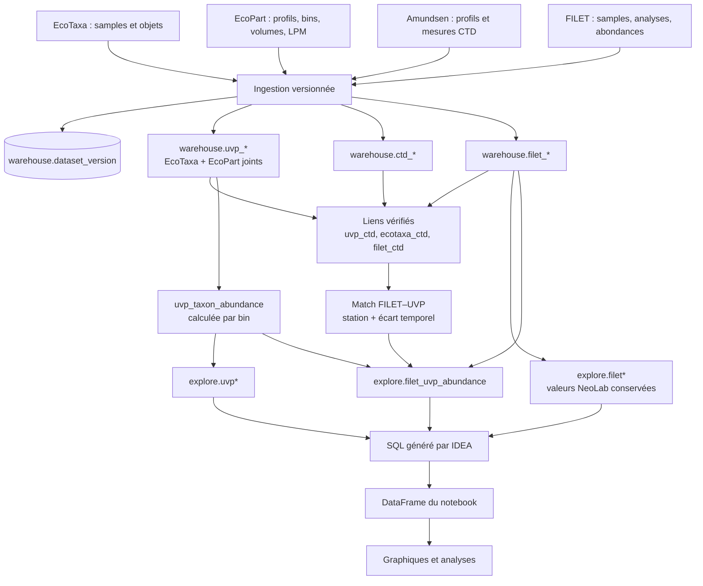

# Architecture du warehouse NeoLab V1

Le warehouse conserve les données sources et leurs clés natives. Les tables
`explore` sont la surface de lecture de l'agent : elles portent aussi les
métadonnées nécessaires (campagne, station, date, position, instrument et
profondeur) pour éviter des tours de jointure dans le notebook.

L'abondance UVP taxonomique est dérivée de `COUNT(EcoTaxa objects)` et du
`Sampled volume [L]` EcoPart. L'abondance FILET est importée depuis les colonnes
NeoLab déjà normalisées. Les filtres de taxon, stade, profondeur et fenêtre
temporelle restent dans le SQL de l'agent ; les relations de provenance sont
résolues à l'ingestion.

Cette V1 est un contrat logique à valider sur les exports retenus. Le DDL est
un brouillon non déployé ; la vue finale de comparaison doit encore être
implémentée après validation des colonnes CTD et des règles de support vertical.
